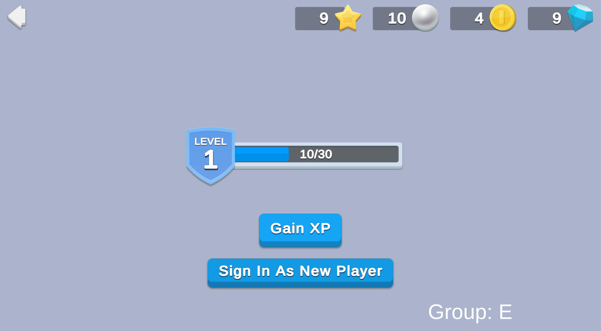

# A/B Test for Level Difficulty
A/B testing is a powerful tool to test different variables on various user segments in parallel to see which variable has the most impact on your game.
A/B tests can be very useful for fine-tuning retention, monetization, or balancing mechanics.

This sample simulates an A/B test to evaluate how much experience (XP) it should take to gain a level.

## Overview

To see this use case in action:
1. In the Unity Editor **Project** window, select **Assets > Use Case Samples > AB Test Level Difficulty**, and then double-click `ABTestLevelDifficultySample.unity` to open the sample scene. 
2. Enter Play Mode to interact with the use case.

When a player signs in, the screen displays their level and an XP meter that tracks their current XP and the total amount of XP required to level up.
In this case, the amount of total XP to level up is either 100, 80, 60, 50, or 30, depending on which test group the player is randomly assigned.
For diagnostic purposes, the player's test group is also displayed (A, B, C, D, or E).

### Initialization

1. When the scene loads, the `ABTestLevelDifficultySceneManager` script initializes Unity Services.
2. The same `InitializeServices` task sends a `SceneOpened` custom event to the Analytics service.
   This, along with the `SceneSessionLength` custom event (sent when you click the back button), tracks the player's session length in the scene as an example of how you can implement analytics to evaluate the results of your test.
3. The same `InitializeServices` task signs in the player using the Authentication service, which assigns the player an anonymous player ID and fetches their data from the Cloud Save service.
   If it’s a new user (not a cached anonymous player), the player's initial level (1) and XP (0) are saved in Cloud Save instead of loading existing data.
4. After authentication succeeds, the same script retrieves and updates currency balances from the Economy service for that user.
5. The client queries the Remote Config service to fetch the appropriate test group name and corresponding XP threshold for leveling up.
6. All of this updated data is displayed in the scene, and the **Gain XP** button becomes interactive.

### Functionality

#### Gain XP

When you click the **Gain XP** button, the simulated player gains 10 XP.
When the XP bar is full (according to the test group threshold), the simulated player levels up and receives currency.
The following occurs:

1. The button’s `OnClick` method sends an `ActionButtonPressed` custom event to the Analytics service and makes a call to the Cloud Code `ABTestLevelDifficulty_GainXPAndLevelIfReady` script.
2. This server-authoritative call fetches the player's information from Cloud Save and Remote Config, increases the XP by the amount specified by Remote Config (in this case, 10), then tests whether the new player XP total equals or exceeds the level-up threshold. 
   * If the player did not level up, their new XP is saved in Cloud Save and returned to the client, which updates the values and shows text that indicates how much XP increased.
   * If the player did level up, it calls the Economy service to distribute the level-up rewards (in this case, 100 Coins), and calls Cloud Save to save the increased player level and new player XP before it returns that information to the client code. 
3. The client code opens a level-up dialog and updates the relevant data in the scene UI.
   Note that this step provides an opportunity to show players different art based on their segmentation, and a convenient way to retrieve additional data for a specific currency at runtime.

**Note:** In this example, a cross-reference dictionary located in Remote Config and initialized at start-up converts the rewarded currency ID (in this case, `COIN`) to an [Addressables](https://docs.unity3d.com/Packages/com.unity.addressables@latest/index.html) address, which you can use to display the sprite (in this case, `Sprites/Currency/Coin`).
A simpler approach to displaying different art according to a player’s segmentation is to attach additional information to the custom data associated with Currencies in the Economy configuration data.
However, here the data was added to the Campaigns to demonstrate the flexibility of the Remote Config service.

#### Sign In As New Player

You can click **Sign In As New Player** at any time to simulate a new player with a new randomly assigned test group that starts with 0 XP.
The following occurs:

1. The button’s `OnClick` deletes the current anonymous player ID, resets all cached values to their empty or default states, and then initiates a new sign-in with the Authentication service that follows the same flow as when the scene first loads.
2. As with the **Gain XP** button, it sends an `ActionButtonPressed` custom event to the Analytics service.
3. Each time you click the **Sign In As New Player** button, the Authentication service creates a new anonymous player ID, to which the Remote Config service assigns a new A/B test group.

#### Back button
If you press the back button (the arrow in the top-left corner of the scene) to return to the "Start Here" scene, it triggers a `SceneSessionLength` custom Analytics event, which captures the amount of time spent in this scene.

## Setup

### Requirements

To replicate this use case, you need the following [Unity packages](https://docs.unity3d.com/Manual/Packages.html) in your project:

| **Package**                                                                                                            | **Role**                                                                                                                                                                                      |
|------------------------------------------------------------------------------------------------------------------------|-----------------------------------------------------------------------------------------------------------------------------------------------------------------------------------------------|
| [Analytics](https://docs.unity.com/analytics/SDKInstallation.html)                                                     | Sends events that track the player's in-game interactions, retention metrics, and other information that you can use to analyze and improve the game experience.                              |
| [Authentication](https://docs.unity.com/authentication/IntroUnityAuthentication.html)                                  | Automatically signs in the player as an anonymous user to keep track of their data server-side.                                                                                               |
| [Cloud Code](https://docs.unity.com/cloud-code/implementation.html)                                                    | Stores validation logic for increasing XP and leveling up the player server-side.                                                                                                             |
| [Cloud Save](https://docs.unity.com/cloud-save/index.html#Implementation)                                              | Provides a server-authoritative way to save player data and the game state. In this example, the service stores the player's level and XP.                                                    |
| [Economy](https://docs.unity.com/economy/implementation.html)                                                          | Retrieves the starting and updated currency balances at runtime.                                                                                                                              |
| [Game Overrides](https://docs.unity3d.com/Packages/com.unity.remote-config@3.2/manual/GameOverridesAndSettings.html)\* | Assigns players to different groups based on the requested distribution values. Players receive a different configuration of XP needed to level up depending on which group they're in.       |
| [Remote Config](https://docs.unity3d.com/Packages/com.unity.remote-config@latest)                                      | Provides key-value pairs that you can map and change server-side, either manually or based on specific Game Overrides. Also stores data associated with currency icon Addressable addresses.  |

\* Note that though it is listed as a package and requires separate dashboard configuration, Game Overrides doesn't actually have an SDK to install from Package Manager. It is a server side offering that affects values returned from other services, like Remote Config.

To use these services in your game, activate each service for your Organization and project in the [Unity Dashboard](https://dashboard.unity3d.com/).

### Dashboard setup

To replicate this sample scene's setup on your own dashboard, you need to:
* Create custom events and parameters for the Analytics service.
* Publish a script to Cloud Code.
* Create a Currency for the Economy service.
* Configure values and Game Overrides for the Remote Config service.

#### Analytics

**Important:** This sample demonstrates the code that is needed to trigger Analytics events.
However, additional code might be necessary to meet legal requirements such as GDPR, CCPA, and PIPL.
For more information, see the documentation on [managing data privacy](https://docs.unity.com/analytics/ManagingDataPrivacy.html).

[Configure the following custom Analytics events](https://docs.unity.com/analytics/EventManager.html#Custom_Events):

| **Event name**        | **Description**                                                                                                                                                                                                                                                   | **Enabled**  | **Custom parameters**                                                                                                                                                             |
|-----------------------|-------------------------------------------------------------------------------------------------------------------------------------------------------------------------------------------------------------------------------------------------------------------|--------------|-----------------------------------------------------------------------------------------------------------------------------------------------------------------------------------|
| `SceneOpened`         | Sent each time you load the scene.                                                                                                                                                                                                                                | `true`       | `sceneName`                                                                                                                                                                       |
| `ActionButtonPressed` | Sent each time you click a button in the scene.                                                                                                                                                                                                                   | `true`       | <ul><li>`abGroup`</li> <li>`buttonName`</li> <li>`buttonNameByABGroup`</li> <li>`buttonNameBySceneName`</li> <li>`buttonNameBySceneNameAndABGroup`</li> <li>`sceneName`</li></ul> |
| `SceneSessionLength`  | Sent to indicate the time between loading the scene and clicking the back button (effectively how much time the player spent in the scene). In this example, you could use this data to understand how much real-world time it takes each test group to level up. | `true`       | <ul><li>`abGroup`</li> <li>`sceneName`</li> <li>`timeRange`</li> <li>`timeRangeByABGroup`</li> <li>`timeRangeBySceneName`</li> <li>`timeRangeBySceneNameAndABGroup`</li></ul>     |

Configure the following custom parameters to support your custom events:

| **Parameter name**                | **Type** | **Description**                                                                                                                                                                                   |
|-----------------------------------|----------|---------------------------------------------------------------------------------------------------------------------------------------------------------------------------------------------------|
| `abGroup`                         | string   | The A/B group and A/B Test ID the player is assigned to. The string format is `"A/B group name (A/B test ID)"`.                                                                                   |
| `buttonName`                      | string   | The name of the button that the player clicked.                                                                                                                                                   |
| `buttonNameByABGroup`             | string   | Groups the name of the button clicked with the player's A/B group. The string format is `"Button name - A/B group name(A/B test ID)"`.                                                            |
| `buttonNameBySceneName`           | string   | Groups the name of the button clicked with the current scene's name. The string format is `"Button name - Scene name"`.                                                                           |
| `buttonNameBySceneNameAndABGroup` | string   | Groups the name of the button clicked with the scene's name and the player's A/B group. The string format is `"Button name - Scene name - A/B group name(A/B test ID)"`.                          |
| `sceneName`                       | string   | The name of the scene where the event is triggered.                                                                                                                                               |
| `timeRange`                       | string   | The amount of time spent in the scene when the event is triggered.                                                                                                                                |
| `timeRangeByABGroup`              | string   | Groups the time spent in the scene when the event is triggered with the player's A/B group. The string format is `"Time range - A/B group name(A/B test ID)"`.                                    |
| `timeRangeBySceneName`            | string   | Groups the time spent in the scene when the event is triggered with the scene's name. The string format is `"Time range - Scene name"`.                                                           |
| `timeRangeBySceneNameAndABGroup`  | string   | Groups the time spent in the scene when the event is triggered with the scene's name and the player's A/B group. The string format is `"Time range - Scene name - A/B group name (A/B test ID)"`. |

**Note:** This extended list of potential parameters allows for a more flexible analysis of different parameter groupings in the [Data Explorer](https://docs.unity.com/analytics/DataExplorer.html) on the Analytics dashboard.
Alternatively, you can send only the ungrouped parameters (for example, buttonName or sceneName) and perform any kind of grouped analysis you want by using the Data Export feature within the Data Explorer.

#### Cloud Code

[Publish the following script](https://docs.unity.com/cloud-code/implementation.html#Writing_your_first_script) in the **LiveOps** dashboard:

| **Script**                                    | **Parameters** | **Description**                                                                                                                   | Location in project                                                                                          |
|-----------------------------------------------|----------------|-----------------------------------------------------------------------------------------------------------------------------------|--------------------------------------------------------------------------------------------------------------|
| `ABTestLevelDifficulty_GainXPAndLevelIfReady` | None           | Increments the player's XP and checks to see if the cumulative XP exceeds the level-up threshold defined by their A/B test group. | `Assets/Use Case Samples/AB Test Level Difficulty/Cloud Code/ABTestLevelDifficulty_GainXPAndLevelIfReady.js` |

**Note:** The Cloud Code scripts included in the Cloud Code folder are local copies because you cannot view the sample project's dashboard.
Changes to these scripts do not affect the behavior of this sample because they are not automatically uploaded to the Cloud Code service.

#### Economy

[Configure the following resources](https://docs.unity.com/economy/) in the **LiveOps** dashboard:

| **Resource type** | **Resource item** | **ID** | **Description**                                                          |
|-------------------|-------------------|--------|--------------------------------------------------------------------------|
| Currency          | Coin              | `COIN` | The currency that is distributed as a reward for the player leveling up. |

#### Remote Config

[Set up the following config values](https://docs.unity.com/remote-config/HowDoesRemoteConfigWork.html) in the **LiveOps** dashboard:

| **Key**                        | **Type** | **Description**                                                              | **Value**                                                                                                                                                                                                                                                                                                                                                                                                                                                                                                                                                                                                                                                                                                                                                                                                                                                                                                                                                                                                                                                                                                                                                                                                                                                                                                                                                                                                                                                                      |
|--------------------------------|----------|------------------------------------------------------------------------------|--------------------------------------------------------------------------------------------------------------------------------------------------------------------------------------------------------------------------------------------------------------------------------------------------------------------------------------------------------------------------------------------------------------------------------------------------------------------------------------------------------------------------------------------------------------------------------------------------------------------------------------------------------------------------------------------------------------------------------------------------------------------------------------------------------------------------------------------------------------------------------------------------------------------------------------------------------------------------------------------------------------------------------------------------------------------------------------------------------------------------------------------------------------------------------------------------------------------------------------------------------------------------------------------------------------------------------------------------------------------------------------------------------------------------------------------------------------------------------|
| `AB_TEST_GROUP`                | string   | The identifier for which test user group the player is in.                   | `""`                                                                                                                                                                                                                                                                                                                                                                                                                                                                                                                                                                                                                                                                                                                                                                                                                                                                                                                                                                                                                                                                                                                                                                                                                                                                                                                                                                                                                                                                           |
| `AB_TEST_ID`                   | string   | The identifier for which A/B Test is actively being run for this user.       | `""`                                                                                                                                                                                                                                                                                                                                                                                                                                                                                                                                                                                                                                                                                                                                                                                                                                                                                                                                                                                                                                                                                                                                                                                                                                                                                                                                                                                                                                                                           |
| `AB_TEST_LEVEL_UP_XP_NEEDED`   | int      | The amount of XP needed for the player to level up.                          | `100`                                                                                                                                                                                                                                                                                                                                                                                                                                                                                                                                                                                                                                                                                                                                                                                                                                                                                                                                                                                                                                                                                                                                                                                                                                                                                                                                                                                                                                                                          |
| `AB_TEST_XP_INCREASE`          | int      | The amount the player's XP will increase by each time they gain XP.          | `10`                                                                                                                                                                                                                                                                                                                                                                                                                                                                                                                                                                                                                                                                                                                                                                                                                                                                                                                                                                                                                                                                                                                                                                                                                                                                                                                                                                                                                                                                           |
| `CURRENCIES`                   | json     | A cross-reference from currencyId to spriteAddresses for all currency types. | { &nbsp;&nbsp;&nbsp;&nbsp;"currencyData": [{ &nbsp;&nbsp;&nbsp;&nbsp;&nbsp;&nbsp;&nbsp;&nbsp;"currencyId": "COIN", &nbsp;&nbsp;&nbsp;&nbsp;&nbsp;&nbsp;&nbsp;&nbsp;"currencySpec": { &nbsp;&nbsp;&nbsp;&nbsp;&nbsp;&nbsp;&nbsp;&nbsp;&nbsp;&nbsp;&nbsp;&nbsp;"spriteAddress": "Sprites/Currency/Coin" &nbsp;&nbsp;&nbsp;&nbsp;&nbsp;&nbsp;&nbsp;&nbsp;} &nbsp;&nbsp;&nbsp;&nbsp;}, { &nbsp;&nbsp;&nbsp;&nbsp;&nbsp;&nbsp;&nbsp;&nbsp;"currencyId": "GEM", &nbsp;&nbsp;&nbsp;&nbsp;&nbsp;&nbsp;&nbsp;&nbsp;"currencySpec": { &nbsp;&nbsp;&nbsp;&nbsp;&nbsp;&nbsp;&nbsp;&nbsp;&nbsp;&nbsp;&nbsp;&nbsp;"spriteAddress": "Sprites/Currency/Gem" &nbsp;&nbsp;&nbsp;&nbsp;&nbsp;&nbsp;&nbsp;&nbsp;} &nbsp;&nbsp;&nbsp;&nbsp;}, { &nbsp;&nbsp;&nbsp;&nbsp;&nbsp;&nbsp;&nbsp;&nbsp;"currencyId": "PEARL", &nbsp;&nbsp;&nbsp;&nbsp;&nbsp;&nbsp;&nbsp;&nbsp;"currencySpec": { &nbsp;&nbsp;&nbsp;&nbsp;&nbsp;&nbsp;&nbsp;&nbsp;&nbsp;&nbsp;&nbsp;&nbsp;"spriteAddress": "Sprites/Currency/Pearl" &nbsp;&nbsp;&nbsp;&nbsp;&nbsp;&nbsp;&nbsp;&nbsp;} &nbsp;&nbsp;&nbsp;&nbsp;}, { &nbsp;&nbsp;&nbsp;&nbsp;&nbsp;&nbsp;&nbsp;&nbsp;"currencyId": "STAR", &nbsp;&nbsp;&nbsp;&nbsp;&nbsp;&nbsp;&nbsp;&nbsp;"currencySpec": { &nbsp;&nbsp;&nbsp;&nbsp;&nbsp;&nbsp;&nbsp;&nbsp;&nbsp;&nbsp;&nbsp;&nbsp;"spriteAddress": "Sprites/Currency/Star" &nbsp;&nbsp;&nbsp;&nbsp;&nbsp;&nbsp;&nbsp;&nbsp;} &nbsp;&nbsp;&nbsp;&nbsp;}] } |
    
 #### Game Overrides

[Configure the following Overrides](https://docs.unity.com/gameoverrides/CreateAnOverride.html) in the **LiveOps** dashboard:

| **Details**    | Name the Override “A/B Test Level Difficulty”.                                                                                                                                                                                                                                                                                                                                                                                                                                                                                                                                                                                                                                                                                                                                                                                                                                                                                                                                                                      |
|----------------|---------------------------------------------------------------------------------------------------------------------------------------------------------------------------------------------------------------------------------------------------------------------------------------------------------------------------------------------------------------------------------------------------------------------------------------------------------------------------------------------------------------------------------------------------------------------------------------------------------------------------------------------------------------------------------------------------------------------------------------------------------------------------------------------------------------------------------------------------------------------------------------------------------------------------------------------------------------------------------------------------------------------|
| **Targeting**  | Select **Stateful (Audiences)** with 100% of audiences targeted.                                                                                                                                                                                                                                                                                                                                                                                                                                                                                                                                                                                                                                                                                                                                                                                                                                                                                                                                                    |
| **Content**    | Select **Choose content type** > **Config Overrides**. <ol><li> Enter override values for the following keys for variant 1:<ul><li>AB_TEST_GROUP: “A”</li> <li>AB_TEST_ID: “LevelDifficultyTest1”</li> <li>AB_TEST_LEVEL_UP_XP_NEEDED: 100</li></ul></li> <li>Enter override values for the following keys for variant 2: <ul><li>AB_TEST_GROUP: “B”</li> <li>AB_TEST_ID: “LevelDifficultyTest1”</li> <li>AB_TEST_LEVEL_UP_XP_NEEDED: 80</li></ul> <li>Enter override values for the following keys for variant 3: <ul><li>AB_TEST_GROUP: “C”</li> <li>AB_TEST_ID: “LevelDifficultyTest1”</li> <li>AB_TEST_LEVEL_UP_XP_NEEDED: 60</li></ul></li> <li>Enter override values for the following keys for variant 4: <ul><li>AB_TEST_GROUP: “D”</li> <li>AB_TEST_ID: “LevelDifficultyTest1”</li> <li>AB_TEST_LEVEL_UP_XP_NEEDED: 50</li></ul></li> <li>Enter override values for the following keys for variant 5: <ul><li>AB_TEST_GROUP: “E”</li> <li>AB_TEST_ID: “LevelDifficultyTest1”</li> <li>AB_TEST_LEVEL_UP_XP_NEEDED: 30</li></ul></li></ol> |
| **Scheduling** | Set the following start and end dates:<ul><li>Set **Start Date** to **Update content immediately**.</li><li>Set **End Date** to **Run indefinitely**.</li></ul>                                                                                                                                                                                                                                                                                                                                                                                                                                                                                                                                                                                                                                                                                                                                                                                                                                                     |

**Important:** After configuring your Overrides, remember to enable them by selecting the Override from the list and clicking the Enable button.
