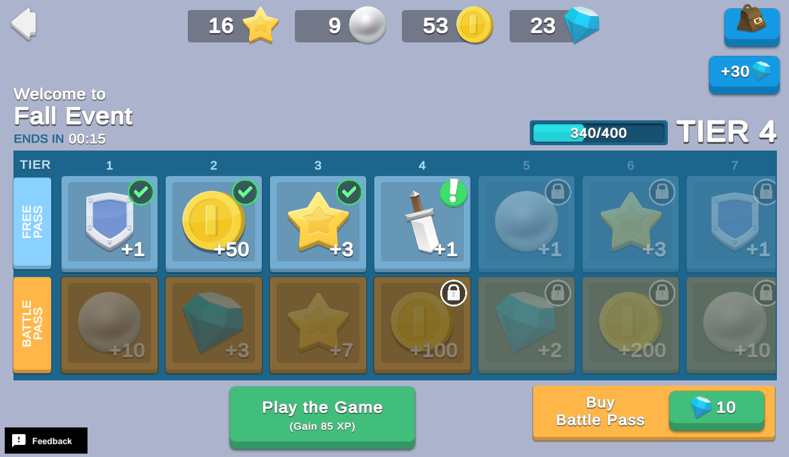

# Battle Pass

A Battle Pass provides additional content for your game, usually through a tiered reward system that players earn by playing the game and completing specific challenges. Battle Pass and their corresponding rewards are only available for a limited time, making them effective monetization and retention features.

Unlike time-based reward systems, Battle Pass require an element of skill to progress through the reward track. The Battle Pass in this sample adds another layer of exclusive appeal by offering a second premium track with additional rewards.

## Overview

**Note**: This sample expands on the [Seasonal Events](https://github.com/Unity-Technologies/com.unity.services.samples.game-operations/blob/main/Assets/Use%20Case%20Samples/Seasonal%20Events/README.md) use case to include a seasonal Battle Pass with a points-based reward system. This topic explains how the Battle Pass sample builds on and complements seasonal events. Unity recommends reviewing the seasonal events use case to understand the underlying implementation before continuing.

Each time a new season starts, the player sees a set of unique event rewards that they can unlock by earning Season XP. There are two reward tracks:
- The **Free Pass** contains normal rewards available to all players.
- The **Battle Pass** costs 10 Gems (premium currency), and grants additional premium rewards.

The Season XP and Battle Pass are only relevant to the active season. When a season ends, the player's Season XP progress and Battle Pass ownership resets, but they retain any claimed event rewards.

To see this use case in action:
1. In the Unity Editor **Project** window, select **Assets** > **Use Case Samples** > **Battle Pass**, and then double-click `BattlePassSample.unity` to open the sample scene.
2. Enter **Play Mode** to interact with the use case.

### Initialization

When the scene loads, the `BattlePassSceneManager` script performs the following initialization steps:
1. Initializes Unity Gaming Services.
2. Signs in the player [anonymously](https://docs.unity.com/authentication/UsingAnonSignIn.html) using the Authentication service. If you’ve previously initialized any of the other sample scenes, Authentication will use your cached Player ID instead of creating a new one.
3. Retrieves and updates currency balances from the Economy service for that authenticated user.
4. Uses Cloud Code to query the Remote Config service for the current values of event-related keys, such as Battle Pass content.

**Note**: The default tier configurations stored in Remote Config are empty. You’ll download varying tier configurations depending on which Game Override is currently active. When the event is scheduled to end, the client calls Remote Config (via Cloud Code) again to get new values and refresh the UI.

### Functionality

The Battle Pass ownership token and reward system is entirely powered by Cloud Code scripts.

#### Play the Game

Each time you click the **Play the Game** button, you earn 85 Season XP. The following occurs on the backend:
1. The button’s `OnClick` method calls the `BattlePass_GainSeasonXP.js` Cloud Code script to validate the current Battle Pass season in case it needs to reset the player’s Season XP.
2. The same script then grants a fixed amount of Season XP.
3. If the Season XP gain results in a tier increase, it updates the reward track accordingly and updates the player’s progress in Cloud Save.

The Season XP bar indicates your active reward tier and your progress towards unlocking the next tier. Each time you unlock a reward tier, its icon changes from a lock to an exclamation mark, indicating that you can claim the reward.

#### Claiming reward tiers

When you click an unlocked reward icon, a pop-up window prompts you to claim that reward tier. When you click the **Claim!** button, the following occurs on the backend:
1. The button’s `OnClick` method calls the `BattlePass_ClaimTier.js` Cloud Code script to validate the current Battle Pass season in case it needs to reset the player’s Season XP.
2. The icon changes to a check mark, to indicate the reward has been claimed.
3. The player’s tier progress is updated again in Cloud Save.

When the season event ends, all Season XP and tier levels reset, but the claimed rewards persist in your inventory.

#### Buy Battle Pass

Click the **Buy Battle Pass** button to purchase the Battle Pass for 10 Gems. Purchasing the Battle Pass retroactively grants the player Battle Pass-exclusive rewards for all previously obtained reward tiers, and makes them eligible to claim exclusive rewards for subsequent tiers. For testing purposes, you can click the **+30** Gems button as many times as you want to add virtual currency to your account through the [Economy](http://www.docs.unity.com/Economy) service. The following occurs on the backend when you click **Buy Battle Pass**:
1. The button’s `OnClick` method calls the `BattlePass_PurchaseBattlePass.js` Cloud Code script, which validates that the player has enough Gems to make the Virtual Purchase through the Economy service.
2. If the player has enough Gems to purchase the Battle Pass, the Cloud Code script grants any previously unlocked Battle Pass rewards through the Economy service.
3. Finally, the Cloud Code script updates the player’s Battle Pass ownership status in Cloud Save, and the UI code disables the **Buy Battle Pass** button until the next season.

**Tip**: You can click the backpack icon to view inventory items that you’ve claimed.

**Note**: This sample uses currencies as premium rewards, though most multiplayer games are designed to award cosmetic items at the premium level, or other items that do not give players a gameplay advantage.

At first glance, it may appear that some of these actions could be simpler calls directly to each service. For example, to get the player's progress, you could download the current player state directly from the Cloud Save SDK, and to purchase a Battle Pass you could make a call directly to the Economy SDK. However, these actions have potential ripple effects that are safer being server-authoritative:
- When retrieving the player's progress, you also need to reset the player's progress if the season has changed.
- When purchasing a Battle Pass, you also want to grant any premium rewards for tiers the player has already claimed.

## Setup

### Requirements

To replicate this use case, you need the following [Unity packages](https://docs.unity3d.com/Manual/Packages.html) in your project:

| **Package**                                                                                                            | **Role**                                                                                                                                                                                                                                                                                                                                                                                                                                                             |
|------------------------------------------------------------------------------------------------------------------------|----------------------------------------------------------------------------------------------------------------------------------------------------------------------------------------------------------------------------------------------------------------------------------------------------------------------------------------------------------------------------------------------------------------------------------------------------------------------|
| [Addressables](https://docs.unity3d.com/Packages/com.unity.addressables@latest)                                        | Allows developers to retrieve an asset by using its address. In this sample, the service looks up event-specific images and prefabs based on the information received from Remote Config.                                                                                                                                                                                                                                                                            |
| [Authentication](https://docs.unity.com/authentication/IntroUnityAuthentication.html)                                  | Automatically signs in the user anonymously to keep track of their data server-side.                                                                                                                                                                                                                                                                                                                                                                                 |
| [Cloud Code](https://docs.unity.com/cloud-code/implementation.html)                                                    | Stores important validation logic server-side. In this sample, it has four main purposes: <ul><li>Retrieving the player's season progress, or resetting their progress if the season has changed.</li><li>Gaining season XP, potentially unlocking new reward tiers.</li><li>Claiming a reward tier, granting currency or inventory items.</li><li>Purchasing a battle pass, which unlocks more rewards and possibly grants rewards for previously claimed tiers. |
| [Cloud Save](https://docs.unity.com/cloud-save/index.html#Implementation)\*                                            | Stores the player's season XP progress and battle pass ownership token. This sample doesn't actually use the Cloud Save methods in C#, as all of the Cloud Save work occurs in Cloud Code scripts.                                                                                                                                                                                                                                                                   |
| [Economy](https://docs.unity.com/economy/implementation.html)                                                          | Retrieves the starting and updated currency balances at runtime.                                                                                                                                                                                                                                                                                                                                                                                                     |
| [Game Overrides](https://docs.unity3d.com/Packages/com.unity.remote-config@3.2/manual/GameOverridesAndSettings.html)\* | Configures the four battle pass seasons and returns different reward tiers based on which Game Override is deemed active based on the current time. Note: These season configurations are shared with the Seasonal Events use case sample.                                                                                                                                                                                                                           |                                                                                                                                                                                                                                                                                                                                                                                                                                                                   |
| [Remote Config](https://docs.unity3d.com/Packages/com.unity.remote-config@latest)\*                                    | Provides key-value pairs where the value that is mapped to a given key can change on the server side, either manually or based on specific Game Overrides.                                                                                                                                                                                                                                                                                                           |

 \*In this sample, the Cloud Save, Remote Config and Game Overrides services are only used on the Cloud Code (server) side. While these services play important roles in the use case, you aren’t required to install their SDKs in your Unity project.

To use these services in your game, activate each service for your Organization and project in the [Unity Dashboard](https://dashboard.unity3d.com/).

### Dashboard setup

To replicate this sample scene's setup on your own dashboard, you need to:
- Publish four scripts in Cloud Code.
- Create four Currencies, two Inventory Items, and one Virtual Purchase for the Economy service.
- Configure values and Game Overrides for the Remote Config service.

#### Cloud Code

[Publish the following scripts](https://docs.unity.com/cloud-code/implementation.html#Writing_your_first_script) in the **LiveOps** dashboard:

| **Script**                      | **Parameters**                                                                                                         | **Description**                                                                                                                                                                   | **Location in project**                                                           |
|---------------------------------|------------------------------------------------------------------------------------------------------------------------|-----------------------------------------------------------------------------------------------------------------------------------------------------------------------------------|-----------------------------------------------------------------------------------|
| `BattlePass_GetState`           | None                                                                                                                   | Retrieves and validates the current event configuration.                                                                                                                          | `Assets/Use Case Samples/Battle Pass/Cloud Code/BattlePass_GetProgress.js`        |
| `BattlePass_GainSeasonXP`       | `amount`  `NUMERIC`  The numeric amount of Season XP gained upon clicking the **Play the Game** button.    | Checks to validate the current Battle Pass season in case it needs to reset the player’s Season XP, then grants a fixed amount of Season XP.                                      | `Assets/Use Case Samples/Battle Pass/Cloud Code/BattlePass_GainSeasonXP.js`       |
| `BattlePass_ClaimTier`          | `tierIndex`  `NUMERIC`  The 0-based index of the reward tier to grant upon clicking the **Claim!** button. | Grants rewards from the appropriate indexed reward tier.                                                                                                                          | `Assets/Use Case Samples/Battle Pass/Cloud Code/BattlePass_ClaimTier.js`          |
| `BattlePass_PurchaseBattlePass` | None                                                                                                                   | Executes a Virtual Purchase for the Battle Pass by updating the player’s ownership token, deducting Gems, and retroactively granting any previously unlocked Battle Pass rewards. | `Assets/Use Case Samples/Battle Pass/Cloud Code/BattlePass_PurchaseBattlePass.js` |

**Note**: The Cloud Code scripts included in the `Cloud Code` folder are local copies because you cannot view the sample project's dashboard. Changes to these scripts do not affect the behavior of this sample because they are not automatically uploaded to the Cloud Code service.

#### Economy

[Configure the following resources](https://docs.unity.com/economy/) in the **LiveOps** dashboard:

| **Resource type** | **Resource item** | **ID**    | **Description**                                                                                                    |
|-------------------|-------------------|-----------|--------------------------------------------------------------------------------------------------------------------|
| Currency          | Gem               | `GEM`     | A premium currency used to purchase the battle pass, and a potential reward for claiming Battle Pass reward tiers. |
| Currency          | Coin              | `COIN`    | A soft currency granted in some Battle Pass reward tiers.                                                          |
| Currency          | Pearl             | `PEARL`   | A soft currency granted in some Battle Pass reward tiers.                                                          |
| Currency          | Star              | `STAR`    | A soft currency granted in some Battle Pass reward tiers.                                                          |
| Inventory Item    | Sword             | `SWORD`   | An inventory item granted by some Battle Pass reward tiers.                                                        |
| Inventory Item    | Shield            | `SHIELD`  | An inventory item granted by some Battle Pass reward tiers.                                                        |

In addition, [configure the following virtual purchase](https://docs.unity.com/economy/item-types.html#Virtual_purchase) for the battle pass:

| **Item name** | **ID**         | **This purchase buys** | **This purchase costs** |
|---------------|----------------|------------------------|-------------------------|
| Battle Pass   | `BATTLE_PASS`  | None\*                 | Gems (10)               |

\*Instead of granting the player virtual items, Cloud Code grants the player Battle Pass ownership in Cloud Save.

#### Remote Config

[Set up the following config values](https://docs.unity.com/remote-config/HowDoesRemoteConfigWork.html) in the **LiveOps** dashboard:

| **Value**                        | **Type** | **Description**                                                                                                                                                                                                                       | **Default value**                                                                   |
|----------------------------------|----------|---------------------------------------------------------------------------------------------------------------------------------------------------------------------------------------------------------------------------------------|-------------------------------------------------------------------------------------|
| `EVENT_NAME`                     | string   | The name of the event to display in the scene.                                                                                                                                                                                        | `""`                                                                                |
| `EVENT_KEY`                      | string   | The key used to look up event-specific values, such as the Addressable addresses for event images.                                                                                                                                    | `""`                                                                                |
| `EVENT_END_TIME`                 | int      | The last digit of the last minute during which the Game Override is active. Used when determining how much time is left in the current event.                                                                                         | `0`                                                                                 |
| `EVENT_TOTAL_DURATION_MINUTES`   | int      | The total number of minutes for which a given season's Game Override is active.                                                                                                                                                       | `0`                                                                                 |
| `BATTLE_PASS_TIER_COUNT`         | int      | The total number of reward tiers each season (not overridden by Game Overrides in this example).                                                                                                                                      | `10`                                                                                |
| `BATTLE_PASS_SEASON_XP_PER_TIER` | int      | The amount of season XP needed to unlock each tier (not overridden by Game Overrides in this example).                                                                                                                                | `100`                                                                               |
| `BATTLE_PASS_REWARDS_FREE`       | JSON     | The JSON that specifies which rewards the game distributes when the player claims each tier (overridden by seasonal Game Overrides).  **Note**: The schema in this example only allows for one reward per tier.                   | `[]` (empty array because reward tiers aren’t valid outside of seasonal events) |
| `BATTLE_PASS_REWARDS_PREMIUM`    | JSON     | The JSON that specifies which rewards the game distributes for each tier when the player owns the Battle Pass (overridden by seasonal Game Overrides).  **Note**: The schema in this example only allows for one reward per tier. | `[]` (empty array because reward tiers aren’t valid outside of seasonal events) |  

#### Game Overrides

[Configure the following Overrides](https://docs.unity.com/gameoverrides/CreateAnOverride.html) in the **LiveOps** dashboard:

| **Details**    | Name the Override “Fall Event”.                                                                                                                                                                                                                                                                                                                                                                                                                                                                                                                                                                                                                                                                                                                                                                                                     |
|----------------|-------------------------------------------------------------------------------------------------------------------------------------------------------------------------------------------------------------------------------------------------------------------------------------------------------------------------------------------------------------------------------------------------------------------------------------------------------------------------------------------------------------------------------------------------------------------------------------------------------------------------------------------------------------------------------------------------------------------------------------------------------------------------------------------------------------------------------------|
| **Targeting**  | Select **Stateless JEXL** with the following JEXL code: user.timestampMinutes % 10 == 0 &vert;&vert; user.timestampMinutes % 10 == 1 &vert;&vert; user.timestampMinutes % 10 == 2                                                                                                                                                                                                                                                                                                                                                                                                                                                                                                                                                                                                                                               |
| **Content**    | Select **Choose content type** > **Config Overrides**, then enter override values for the following keys: <ul><li>`EVENT_NAME`: `“Fall Event”`</li><li>`EVENT_KEY`: `“Fall”`</li><li>`EVENT_END_TIME`: `2`</li><li>`EVENT_TOTAL_DURATION_MINUTES`: `3`</li><li>`BATTLE_PASS_REWARDS_FREE` (array of objects):</li><ul>\[<ul>{<ul>// Add a free reward for tier 1: "service": "inventory", "id": "SWORD", "quantity": 1, "spriteAddress": "Sprites/Inventory/Sword" </ul>}, { <ul>// Add a free reward for each additional tier.</ul>}</ul>]</ul><li>`BATTLE_PASS_REWARDS_PREMIUM` (array of objects):</li><ul>\[<ul>{<ul>// Add a premium reward for tier 1: "service": "currency", "id": "PEARL", "quantity": 50, "spriteAddress": "Sprites/Inventory/Pearl"</ul>}, {<ul>// Add a premium reward for each additional tier.</ul>}</ul>] |
| **Scheduling** | Set the following start and end dates:<ul><li>Set **Start Date** to **Update content immediately**.</li><li>Set **End Date** to **Run indefinitely**.</li></ul>                                                                                                                                                                                                                                                                                                                                                                                                                                                                                                                                                                                                                                                                     |

| **Details**    | Name the Override “Winter Event”.                                                                                                                                                                                                                                                                                                                                                                                                                                                                |
|----------------|--------------------------------------------------------------------------------------------------------------------------------------------------------------------------------------------------------------------------------------------------------------------------------------------------------------------------------------------------------------------------------------------------------------------------------------------------------------------------------------------------|
| **Targeting**  | Select **Stateless JEXL** with the following JEXL code: user.timestampMinutes % 10 == 3 &vert;&vert; user.timestampMinutes % 10 == 4                                                                                                                                                                                                                                                                                                                                                          |
| **Content**    | Select **Choose content type** > **Config Overrides**, then enter override values for the following keys: <ul><li>`EVENT_NAME`: `“Winter Event”`/li><li>`EVENT_KEY`: `“Winter”`</li><li>`EVENT_END_TIME`: `4`</li><li>`EVENT_TOTAL_DURATION_MINUTES`: `2`</li><li>Configure the overrides for your `BATTLE_PASS_REWARDS_FREE` and `BATTLE_PASS_REWARDS_PREMIUM` keys, which are arrays of objects, as you did for the Fall Event, populating the JSON overrides with different rewards.</li> |
| **Scheduling** | Set the following start and end dates:<ul><li>Set **Start Date** to **Update content immediately**.</li><li>Set **End Date** to **Run indefinitely**.</li></ul>                                                                                                                                                                                                                                                                                                                                  |

| **Details**    | Name the Override “Spring Event”.                                                                                                                                                                                                                                                                                                                                                                                                                                                                 |
|----------------|---------------------------------------------------------------------------------------------------------------------------------------------------------------------------------------------------------------------------------------------------------------------------------------------------------------------------------------------------------------------------------------------------------------------------------------------------------------------------------------------------|
| **Targeting**  | Select **Stateless JEXL** with the following JEXL code: user.timestampMinutes % 10 == 5 &vert;&vert; user.timestampMinutes % 10 == 6 &vert;&vert; user.timestampMinutes % 10 == 7                                                                                                                                                                                                                                                                                                              |
| **Content**    | Select **Choose content type** > **Config Overrides**, then enter override values for the following keys: <ul><li>`EVENT_NAME`: `“Spring Event”`</li><li>`EVENT_KEY`: `“Spring"`</li><li>`EVENT_END_TIME`: `7`</li><li>`EVENT_TOTAL_DURATION_MINUTES`: `3`</li><li>Configure the overrides for your `BATTLE_PASS_REWARDS_FREE` and `BATTLE_PASS_REWARDS_PREMIUM` keys, which are arrays of objects, as you did for the Fall Event, populating the JSON overrides with different rewards.</li> |
| **Scheduling** | Set the following start and end dates:<ul><li>Set **Start Date** to **Update content immediately**.</li><li>Set **End Date** to **Run indefinitely**.</li></ul>                                                                                                                                                                                                                                                                                                                                   |

| **Details**    | Name the Override “Summer Event”.                                                                                                                                                                                                                                                                                                                                                                                                                                                                 |
|----------------|---------------------------------------------------------------------------------------------------------------------------------------------------------------------------------------------------------------------------------------------------------------------------------------------------------------------------------------------------------------------------------------------------------------------------------------------------------------------------------------------------|
| **Targeting**  | Select **Stateless JEXL** with the following JEXL code: user.timestampMinutes % 10 == 8 &vert;&vert; user.timestampMinutes % 10 == 9                                                                                                                                                                                                                                                                                                                                                           |
| **Content**    | Select **Choose content type** > **Config Overrides**, then enter override values for the following keys: <ul><li>`EVENT_NAME`: `“Summer Event”`</li><li>`EVENT_KEY`: `“Summer”`</li><li>`EVENT_END_TIME`: `9`</li><li>`EVENT_TOTAL_DURATION_MINUTES`: `2`</li><li>Configure the overrides for your `BATTLE_PASS_REWARDS_FREE` and `BATTLE_PASS_REWARDS_PREMIUM` keys, which are arrays of objects, as you did for the Fall Event, populating the JSON overrides with different rewards.</li> |
| **Scheduling** | Set the following start and end dates:<ul><li>Set **Start Date** to **Update content immediately**.</li><li>Set **End Date** to **Run indefinitely**.</li></ul>                                                                                                                                                                                                                                                                                                                                   |

**Important**: After configuring your Overrides, remember to enable them by selecting the Override from the list and clicking the **Enable** button.

**Note**: This sample determines which Game Override data should be returned based on the last digit of the number of minutes in the current server time. This is a simplification to be able to frequently observe the season change. In a real app, developers likely set up a Game Override to have specific start and end dates, then Remote Config determines when the Game Override is shown based on the server’s date and time. In that case, the client and server implementations can be a bit different.  
