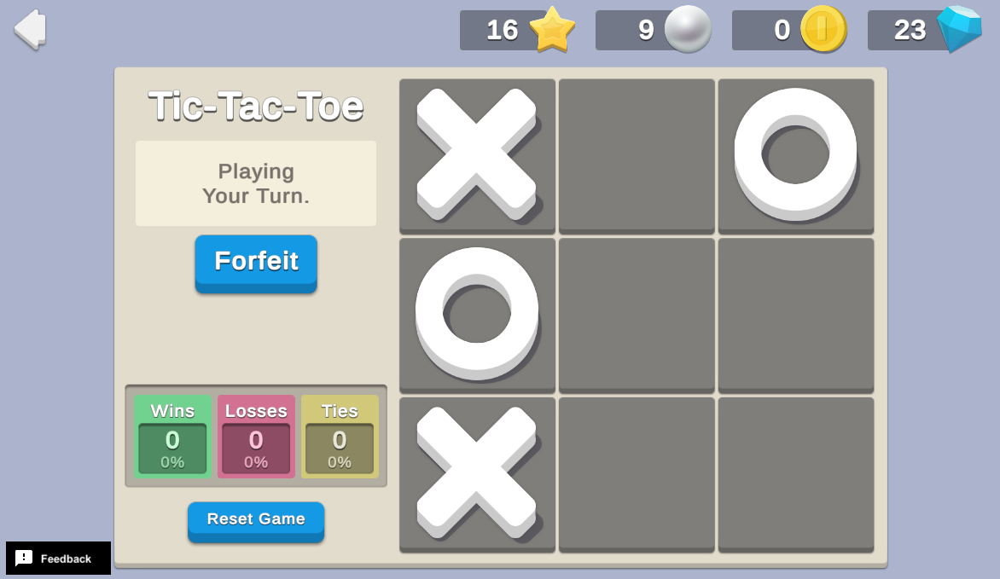

# Cloud AI Mini Game


Mini games introduce fun ways to earn additional rewards or advance gameplay. This sample demonstrates how to use Cloud Code with other UGS packages to validate game play by implementing a simple artificial opponent against the player in a tic-tac-toe mini game.




## Overview

In this sample, each mini game begins with a random player (50% human, 50% AI) and progresses until a player successfully places 3 pieces in a row (win) or the board is full (tie). The player receives 100 Coins for a win, 25 Coins for a tie, and nothing for a loss.

To see this use case in action:
1. In the Unity Editor **Project** window, select **Assets** > **Use Case Samples** > **Cloud AI Mini Game**, and then double-click `CloudAIMiniGameSample.unity` to open the sample scene.
2. Enter Play Mode to interact with the use case.


### Initialization

The `CloudAIMiniGameSceneManager.cs` script performs the following initialization tasks in its `Start` function:
1. Initializes Unity Gaming Services.
2. Signs in the player [anonymously](https://docs.unity.com/authentication/UsingAnonSignIn.html) using the Authentication service. If you’ve previously initialized any of the other sample scenes, Authentication will use your cached Player ID instead of creating a new one.
3. Retrieves and updates currency balances from the Economy service for that authenticated user.
4. Calls the `CloudAiMiniGame_GetState.js` Cloud Code script to retrieve the current game state from the Cloud Save service, and updates the game state for the current tic-tac-toe game or creates a new one.


### Functionality


When you click the **New Game** button (or the **Forfeit** button when a game is in progress), the following occurs on the backend:
1. The button’s `OnClick` method calls the `CloudAiMiniGame_StartNewGame.js` Cloud Code script to check if a game is in progress (the `isGameOver` variable is `false`).
2. If a game is in progress, the player receives a loss for forfeiting.
3. The script then creates a new game, clearing the board and randomly choosing the player or AI to go first.
4. If the AI is selected to go first, the AI places a piece on a random spot on the board.
5. The new game state is returned to the client.

When a game is in progress you can click on a game tile to attempt to place a piece. The following occurs on the backend:
1. The client calls the `CloudAiMiniGame_ValidatePlayerMoveAndRespond.js` Cloud Code script, passing your click coordinates to the script.
2. The move is validated based on the coordinate inputs. If the game is over or the tile is occupied, the move is invalid.

3. If the move is valid, the script updates the game state to reflect the new piece placement, then places the piece on the client-side game board.

4. The script checks to see if the new move triggers a game-over condition (either three in a row, or the board is full).

5. If the game is not over, the script places an AI piece according to the following logic:

   1. If the AI can win, it always will (for example, if the AI has 2 pieces in a row with an empty space, it will make the winning play).
   2. If the player has 2 in a row, the AI will always block the player's winning move.
   3. If neither a or b are true, it plays randomly.

6. If the game is over, the script calls the Economy service to distribute rewards directly, according to the win condition detected. If the player won, they receive 100 Coins. If the board is full, they receive 25 Coins.

The Cloud Save service keeps a JSON record of the full game state, using the `CLOUD_AI_GAME_STATE` key string. The associated value stores sequential moves made by each player, the overall state, flags for game-over, player turn, whether this is a new game or move, and a persistent counter for wins, losses, and ties.

The **Reset Game** button exists to demonstrate the full game cycle. At the start of the first game (or when manually resetting the game), Cloud Code removes the `CLOUD_AI_GAME_STATE` key from Cloud Save and calls the `CloudAiMiniGame_GetState.js` Cloud Code script to reset the Coin balance to 0, create a new save state with all counters set to 0, generate a new game board, and choose a random starting player.


#### Example Cloud Save game states:

`CLOUD_AI_GAME_STATE` for a new game with the AI going first:
```json
{
  "winCount":1,
  "lossCount":1,
  "tieCount":0,
  "playerPieces":[],
  "aiPieces":[{"x":0,"y":1}],
  "isNewGame":true,
  "isNewMove":true,
  "isPlayerTurn":true,
  "isGameOver":false,
  "status":"playing"
}
```

`CLOUD_AI_GAME_STATE` when the player wins the game:
```json
{
  "winCount":2,
  "lossCount":1,
  "tieCount":0,
  "playerPieces":[{"x":0,"y":0},{"x":0,"y":2},{"x":2,"y":2},{"x":1,"y":1}],
  "aiPieces":[{"x":0,"y":1},{"x":2,"y":0},{"x":1,"y":2}],
  "isNewGame":false,
  "isNewMove":false,
  "isPlayerTurn":false,
  "isGameOver":true,
  "status":"playerWon"
}

```


## Setup


### Requirements

To replicate this use case, you need the following [Unity packages](https://docs.unity3d.com/Manual/Packages.html) in your project:

| **Package**                                                                           | **Role**                                                                                                            |
|---------------------------------------------------------------------------------------|---------------------------------------------------------------------------------------------------------------------|
| [Authentication](https://docs.unity.com/authentication/IntroUnityAuthentication.html) | Automatically signs in the player as an anonymous user to keep track of their data server-side.                     |
| [Cloud Code](https://docs.unity.com/cloud-code/implementation.html)                   | Generates random games, validates game logic, executes AI turns, and grants Economy rewards based on game outcomes. |
| [Cloud Save](https://docs.unity.com/cloud-save/index.html#Implementation)             | Stores the active game state.                                                                                       |
| [Economy](https://docs.unity.com/economy/implementation.html)                         | Retrieves the starting and updated currency balances at runtime.                                                    |

To use these services in your game, activate each service for your Organization and project in the[Unity Dashboard](https://dashboard.unity3d.com/).


### Dashboard setup


To replicate this sample scene's setup on your own dashboard, you need to:
- Publish three scripts to Cloud Code.
- Create a Currency for the Economy service.


#### Cloud Code


[Publish the following scripts](https://docs.unity.com/cloud-code/implementation.html#Writing_your_first_script) in the **LiveOps** dashboard:

| **Script**                                     | **Parameters**                                                                                                  | **Description**                                                                                                                                                                                                                                                                                                                                                                                                   | **Location in project**                                                                                 |
|------------------------------------------------|-----------------------------------------------------------------------------------------------------------------|-------------------------------------------------------------------------------------------------------------------------------------------------------------------------------------------------------------------------------------------------------------------------------------------------------------------------------------------------------------------------------------------------------------------|---------------------------------------------------------------------------------------------------------|
| `CloudAiMiniGame_GetState`                     | None                                                                                                            | Creates and saves a random game if no game is in progress. If it’s the player's first game (or their first game after clicking the **Reset Game** button, it also resets the Coin quantity to 0, then returns the current game state.                                                                                                                                                                             | `Assets/Use Case Samples/Cloud AI Mini Game/Cloud Code/CloudAiMiniGame_GetState.js`                     |
| `CloudAiMiniGame_ValidatePlayerMoveAndRespond` | `coord`<br><br>`JSON`<br><br>The {x,y} coordinate for the player piece to add.<br><br>Example: `{"x":0, "y":0}` | Validates the player's requested move and adds it to the game state based on the coordinates of the mouse click. After updating the game state, it checks for game-over conditions. if the game is not over, it places an AI piece then checks for game-over conditions again, and returns the final updated state to the client. If the player wins or ties, it awards Coins directly using the Economy service. | `Assets/Use Case Samples/Cloud AI Mini Game/Cloud Code/CloudAiMiniGame_ValidatePlayerMoveAndRespond.js` |
| `CloudAiMiniGame_StartNewGame`                 | None                                                                                                            | Called when clicking the **New Game** or **Forfeit** button, to assign the player a loss in the case of a forfeit and generate a new random game with a random starting player.                                                                                                                                                                                                                                   | `Assets/Use Case Samples/Cloud AI Mini Game/Cloud Code/CloudAiMiniGame_StartNewGame.js`                 |

**Note**: The Cloud Code scripts included in theCloud Code folder are local copies because you cannot view the sample project's dashboard. Changes to these scripts do not affect the behavior of this sample because they are not automatically uploaded to the Cloud Code service.


#### Economy


[Configure the following resource](https://docs.unity.com/economy/) in the **LiveOps** dashboard:

| **Resource type** | **Resource item** | **ID** | **Description**                     |
| ----------------- | ----------------- | ------ | ----------------------------------- |
| Currency          | Coin              | `COIN` | Currency awarded for wins and ties. |  
