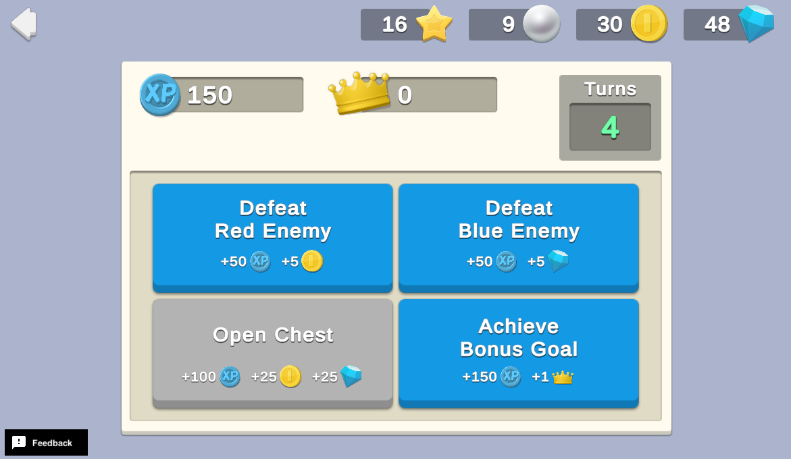

# Command Batching

Command batching is the concept where each game action is a Command which can be collected into a queue to be sent to the server in batches for processing. Command batching optimizes your game’s bandwidth to be as energy efficient as possible, and prevent poor performance due to frequent server calls or rate limiting. This provides a smoother game experience with less downtime.

In this sample, the player has a fixed number of turns. Each simulated action generates a command that is cached, then executed by the server as part of a batch at the end of the game, thereby reducing the number of calls to the server.

For example, consider a game that distributes rewards after every action by calling Cloud Save to distribute player XP and Economy to distribute Coins. The player completes the following three actions:
- The first action results in 100 XP and 10 Coins.
- The second action results in 50 XP and 5 Coins.
- The third action results in 200 XP and 30 Coins.

These three actions would result in a minimum of six calls to various Unity Services (in this case, Cloud Save and Economy). However, if all three of these actions are stored as batch commands and processed a single time, the game would only make two Unity Services calls: one to Cloud Save to increase XP by 350, and one to Economy to add 45 Coins.

## Overview

To see this use case in action:
1. In the Unity Editor **Project** window, select **Assets** > **Use Case Samples** > **Command Batching**, and then double-click `CommandBatchingSample.unity` to open the sample scene.
2. Enter **Play Mode** to interact with the use case.

### Initialization

The `CommandBatchingSceneManager.cs` script performs the following initialization tasks in its `Start` function:
1. Initializes Unity Gaming Services.
2. Signs in the player by using the Authentication service.
3. Retrieves and updates the player's currency balances from the Economy service.
4. Initializes the game interface and buttons.

### Functionality

#### Player turns

In this sample, a single "game" involves making a fixed number of turns, where a single turn is completed by clicking on one of four buttons. Each button represents a simulated action with corresponding rewards. When you click on one of the action buttons, the following occurs on the backend:
1. The button’s `OnClick` method calls the `CommandBatchingSceneManager.cs` script, which consumes a turn.
2. The script then generates a command associated with the action you clicked and sends it to the batch queue for future server processing. Each command uses Remote Config values to map rewards for the corresponding action.
3. It also calls that action’s associated `CommandSystem` script to distribute rewards to the client.
 **Note**: Local reward distribution allows players to immediately see the results of the turn, but is not server-authoritative. The server overwrites any local distributions after it validates and processes all commands at the end of the game.
4. Finally, the calling script checks to see if the player is out of turns, in which case it triggers the game-over condition.

#### Gave over

When the player has zero turns remaining, the game is over. The following occurs on the backend:
1. The client adds a final game over command to the batch queue.
2. The client sends the entire command queue to Cloud Code as a single JSON.
3. The `CommandBatching_ProcessBatch.js` Cloud Code script unpacks the JSON blob into a list of commands again, then verifies that the batch contains the exact number of expected commands in a valid order (for example, the player cannot trigger the **Achieve Bonus Goal** command until the **Open Chest** command occurs).
4. If the batch is valid, the Cloud Code script retrieves the rewards to distribute from Remote Config values then issues them directly through the Economy (currencies) and Cloud Save (`XP` and `GoalsAchieved`) services. If the batch is invalid, the script returns an error and rewards will not be distributed on the server.

Mapping the rewards in Remote Config allows you to tune them remotely in a single place, affecting both the client-side and server-side distributions simultaneously. The rewards for all commands in the batch are grouped by type, so if multiple commands increase XP, the total XP gains are added up and updated with a single server call to Cloud Save.

Whether or not the Cloud Code script returns success or failure, the client code calls the Unity Services to retrieve their latest data. If the batch was processed successfully by the server, this should result in no visible change to the player's Currency, GoalsAchieved or XP HUDs, because from their perspective the rewards were distributed immediately during game play. However, if the Cloud Code script failed to process an invalid batch, the client updates the player's status back to what it was before the game was played, overwriting the local state.

**Note**: This creates a mixed-authoritative game. At certain times, the game relies on the local (client) authority to know the player's stats and currency balances. However, the server ultimately has final authority on the player's state. While this mixed-authority setup is not appropriate for all game styles, it can be very useful for others, such as turn-based, single-player, infinite runner, and puzzle games. Command batching can also be a good starting point when developing a solution for offline support or bad connection tolerance in games that choose to provide such features.

## Setup

### Requirements

To replicate this use case, you need the following [Unity packages](https://docs.unity3d.com/Manual/Packages.html) in your project:

| **Package**                                                                           | **Role**                                                                                                                               |
|---------------------------------------------------------------------------------------|----------------------------------------------------------------------------------------------------------------------------------------|
| [Authentication](https://docs.unity.com/authentication/IntroUnityAuthentication.html) | Automatically signs in the player as an anonymous user to keep track of their data server-side.                                        |
| [Cloud Code](https://docs.unity.com/cloud-code/implementation.html)                   | Processes queued commands at the end of a game.                                                                                        |
| [Cloud Save](https://docs.unity.com/cloud-save/index.html#Implementation)             | Stores the mapping between commands and their corresponding rewards, which the client and Cloud Code references to distribute rewards. |
| [Economy](https://docs.unity.com/economy/implementation.html)                         | Retrieves the starting and updated currency balances at runtime.                                                                       |
| [Remote Config](https://docs.unity3d.com/Packages/com.unity.remote-config@latest)     | Maintains key-value stores for player stats, such as XP and Goals Achieved.                                                            |

To use these services in your game, activate each service for your Organization and project in the [Unity Dashboard](https://dashboard.unity3d.com/).

### Dashboard setup

To replicate this sample scene's setup on your own dashboard, you need to:
- Publish a script in Cloud Code.
- Create two Currencies for the Economy service.
- Configure Remote Config values.

#### Cloud Code

| **Script**                     | **Parameters**                                                                                                                                                                                                                                                                                                          | **Description**                                  | **Location**                                                                          |
|--------------------------------|-------------------------------------------------------------------------------------------------------------------------------------------------------------------------------------------------------------------------------------------------------------------------------------------------------------------------|--------------------------------------------------|---------------------------------------------------------------------------------------|
| `CommandBatching_ProcessBatch` | `commands`  `JSON`  An array of command keys. For example:  `{"commands": ["COMMANDBATCH_DEFEAT_RED_ENEMY", "COMMANDBATCH_OPEN_CHEST", "COMMANDBATCH_ACHIEVE_BONUS_GOAL", "COMMANDBATCH_DEFEAT_BLUE_ENEMY", "COMMANDBATCH_OPEN_CHEST", "COMMANDBATCH_ACHIEVE_BONUS_GOAL", "COMMANDBATCH_GAME_OVER"]}` | Processes queued commands at the end of a game.  | `Assets/Use Case Samples/Command Batching/Cloud Code/CommandBatching_ProcessBatch.js` |

**Note**: The Cloud Code scripts included in theCloud Code folder are local copies because you cannot see the sample's dashboard. Changes to these scripts do not affect the behavior of this sample because they are not automatically uploaded to the Cloud Code service.

#### Economy

| **Resource type** | **Resource name** | **ID** | **Description**               |
|-------------------|-------------------|--------|-------------------------------|
| Currency          | Coin              | `COIN` | A reward for certain actions. |
| Currency          | Gem               | `GEM`  | A reward for certain actions. |

#### Remote Config

[Set up the following config values](https://docs.unity.com/remote-config/HowDoesRemoteConfigWork.html) in the **LiveOps** dashboard:

| **Value**                            | **Type** | **Description**                                                                  | **Default value**                                                                                                                                                                                                                                                                                      |
|--------------------------------------|----------|----------------------------------------------------------------------------------|--------------------------------------------------------------------------------------------------------------------------------------------------------------------------------------------------------------------------------------------------------------------------------------------------------|
| `COMMANDBATCH_ACHIEVE_BONUS_GOAL`*   | JSON     | Maps the **Achieve Bonus Goal** command to its corresponding rewards.            | <ul>{ <ul>"rewards":</ul><ul>\[{<ul>"service": "cloudSave",</ul><ul>"id": "COMMAND_BATCH_XP",</ul><ul>"amount": 150</ul>}, {<ul>"service": "cloudSave",</ul><ul>"id": COMMAND_BATCH_GOALS_ACHIEVED",</ul><ul>"amount": 1</ul>}]</ul>}</ul>                                                          |
| `COMMANDBATCH_DEFEAT_BLUE_ENEMY`*    | JSON     | Maps the **Defeat Blue Enemy** button action to its corresponding rewards.       | <ul>{ <ul>"rewards":</ul><ul>\[{<ul>"service": "cloudSave",</ul><ul>"id": "COMMAND_BATCH_XP",</ul><ul>"amount": 50</ul>}, {<ul>"service": "currency",</ul><ul>"id": “GEM",</ul><ul>"amount": 5</ul>}]</ul>}</ul>                                                                                    |
| `COMMANDBATCH_DEFEAT_RED_ENEMY`*     | JSON     | Maps the **Defeat Red Enemy** button action to its corresponding rewards.        | <ul>{ <ul>"rewards":</ul><ul>\[{<ul>"service": "cloudSave",</ul><ul>"id": "COMMAND_BATCH_XP",</ul><ul>"amount": 50</ul>}, {<ul>"service": "currency",</ul><ul>"id": COIN",</ul><ul>"amount": 5</ul>}]</ul>}</ul>                                                                                    |
| `COMMANDBATCH_OPEN_CHEST`*           | JSON     | Maps the **Open Chest** button action to its corresponding rewards.              | <ul>{ <ul>"rewards":</ul><ul>\[{<ul>"service": "cloudSave",</ul><ul>"id": "COMMAND_BATCH_XP",</ul><ul>"amount": 100</ul>}, {<ul>"service": "currency",</ul><ul>"id": “COIN",</ul><ul>"amount": 25</ul>}, {<ul>"service": "currency",</ul><ul>"id": “GEM",</ul><ul>"amount": 25</ul>}]</ul>}</ul> |
| `COMMANDBATCH_GAME_OVER`*            | JSON     | Maps the game over command (no more turns remain) to its corresponding rewards.  | <ul>{ <ul>"rewards":</ul><ul>\[{<ul>"service": "cloudSave",</ul><ul>"id": "COMMAND_BATCH_XP",</ul><ul>"amount": 100</ul>}]</ul>}</ul>                                                                                                                                                                  |

**\*Note**: The Remote Config `Values` are specific commands and cannot be changed nor new ones created without making corresponding changes to the Unity C# scripts and/or Cloud Code scripts.
