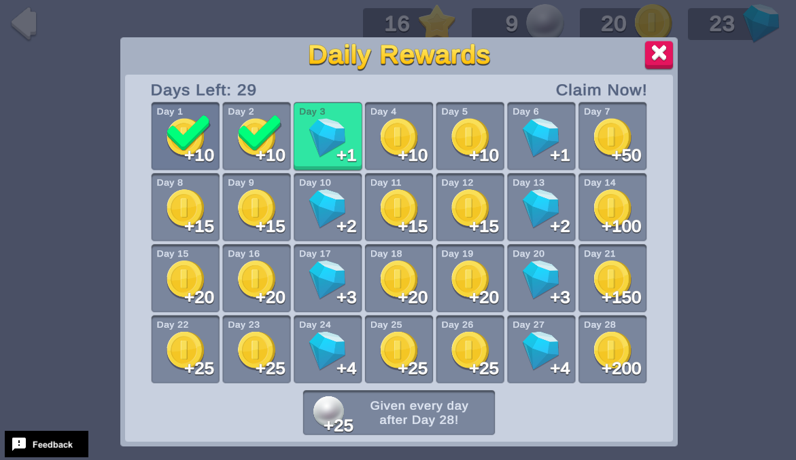

# Daily Rewards


Daily reward calendars are prevalent engagement features that can boost retention in games of all genres. Showing players an escalating series of rewards in advance incentivizes them to keep signing in to claim better and better prizes.

This sample demonstrates how to present a calendar of rewards that increase in value over time, which encourages players to return each day to claim them. This implementation permits skipping days, but the player always claims rewards sequentially. If they miss a day, the same reward is available the next day. The player must claim a given day's reward to unlock the subsequent day's reward.




## Overview

This sample demonstrates how to initialize Unity Services, retrieve and update current values from the Economy service, call Cloud Code to retrieve the updated status, and then claim each day's reward.

**Note**: Unity recommends implementing daily rewards by setting the start epoch time with Remote Config so all players experience the event starting on the first day of the month. However, to facilitate testing, this implementation saves the event start value to Cloud Save, so the event "month" starts when you first open the scene. Each "day" is also compressed into 30 seconds, which allows you to quickly test claiming an entire month's rewards.

To see this use case in action:
1. In the Unity Editor **Project** window, select **Assets**.
2. Double-click `Start Here.unity` to open the samples menu scene.
3. Enter **Play Mode**.
4. Click **Daily Rewards** to interact with this use case.


### Initialization

The `DailyRewardsSceneManager.cs` script performs the following initialization tasks in its `Start` function:
1. Initializes Unity Gaming Services.
2. Signs in the player [anonymously](https://docs.unity.com/authentication/UsingAnonSignIn.html) using the Authentication service. If you’ve previously initialized any of the other sample scenes, Authentication will use your cached Player ID instead of creating a new one.
3. Retrieves and updates currency balances from the Economy service.
4. Retrieves all the currency sprites from the Addressables service so they can be displayed in the calendar.
5. Retrieves the daily rewards event status from Remote Config, to display claimed days and days remaining in the calendar.


### Functionality

When you dismiss the event prompt, the scene begins tracking the passage of time to determine whether you claim a reward within the eligible window for a given day. For testing purposes, each "day" lasts about 30 seconds. Each calendar node has a **Claim** button that is only active when two conditions are met:
1. The previous day's reward has been claimed.
2. A new “day” has begun.

When you click an active **Claim** button, you receive the reward for that day. The following occurs on the backend:
1. The button's `OnClick` method executes the `DailyRewardsSceneManager` script's `OnClaimButtonPressed` function, which verifies that the player is signed in, and then calls the `DailyRewards_Claim` Cloud Code script to grant the reward and update the event state to record days collected and the last claim time.
2. The Economy service updates the player's currency balances and returns the new values to the client to update the currencies HUD.

If the client remains idle (you do not claim the reward within a day's timeframe), the **Days Left** UI indicator decreases, which indicates that you missed a day. If you miss a day, you can still claim the previous day's reward.

In this sample, the month is 31 days. If you claim rewards for at least 28 days in that month, you are eligible for a bonus reward each additional day until the event ends (up to 3 times, if every day is collected on time). When the event ends (31 days expire), you can dismiss the daily rewards window and click the **Daily Rewards** button in the bottom-right corner to begin a new event.


## Setup


### Requirements

To replicate this use case, you need the following [Unity packages](https://docs.unity3d.com/Manual/Packages.html) in your project:

| **Package**                                                                                       | **Role**                                                                                                                                                                                                                                                                          |
|---------------------------------------------------------------------------------------------------|-----------------------------------------------------------------------------------------------------------------------------------------------------------------------------------------------------------------------------------------------------------------------------------|
| [Addressables](https://docs.unity3d.com/Packages/com.unity.addressables@latest)                   | Allows asset retrieval by address.                                                                                                                                                                                                                                                |
| [Authentication](https://docs.unity.com/authentication/IntroUnityAuthentication.html)             | Automatically signs in the user anonymously to keep track of their data server-side.                                                                                                                                                                                              |
| [Cloud Code](https://docs.unity.com/cloud-code/implementation.html)                               | Accesses the current event status, claims daily rewards, and resets the feature at the end of the month for demonstration purposes. It also calls Remote Config to determine the parameters to use for the daily rewards (such as which rewards to grant and in what quantities). |
| [Cloud Save](https://docs.unity.com/cloud-save/index.html#Implementation)                         | Stores and retrieves event status data (such as start epoch time and the number of days successfully claimed).                                                                                                                                                                    |
| [Economy](https://docs.unity.com/economy/implementation.html)                                     | Retrieves the player's starting and updated currency balances at runtime and receives requests directly from Cloud Code to grant rewards.                                                                                                                                         |
| [Remote Config](https://docs.unity3d.com/Packages/com.unity.remote-config@latest)                 | Defines parameters for the daily rewards event.                                                                                                                                                                                                                                   |

To use these services in your game, activate each service for your Organization and project in the [Unity Dashboard](https://dashboard.unity3d.com/).


### Dashboard setup

To replicate this sample scene's setup on your own dashboard, you need to:
- Publish three scripts in Cloud Code.
- Create four Currencies for the Economy service.


#### Cloud Code

[Publish the following scripts](https://docs.unity.com/cloud-code/implementation.html#Writing_your_first_script) in the **LiveOps** dashboard:

| **Script**                | **Parameters** | **Description**                                                                                                                                       | **Location in project**                                                       |
|---------------------------| -------------- | ----------------------------------------------------------------------------------------------------------------------------------------------------- |-------------------------------------------------------------------------------|
| `DailyRewards_GetStatus`  | None           | Called at startup to retrieve the current status of the event from Cloud Save, update it, and then return it to the client.                           | `Assets/Use Case Samples/Daily Rewards/Cloud Code/DailyRewards_GetStatus.js`  |
| `DailyRewards_Claim`      | None           | Called in response to a reward claim request to verify eligibility, grant the appropriate day's reward, and then update the user state on Cloud Save. | `Assets/Use Case Samples/Daily Rewards/Cloud Code/DailyRewards_Claim.js`      |
| `DailyRewards_ResetEvent` | None           | Resets the daily rewards state on the client to simulate the beginning of a new month's rewards.                                                      | `Assets/Use Case Samples/Daily Rewards/Cloud Code/DailyRewards_ResetEvent.js` |

**Note**: The Cloud Code scripts included in the Cloud Code folder are local copies because you cannot view the sample project's dashboard. Changes to these scripts do not affect the behavior of this sample because they are not automatically uploaded to the Cloud Code service.


#### Economy

[Configure the following resources](https://docs.unity.com/economy/) in the **LiveOps** dashboard:

| **Resource type** | **Resource name** | **ID** | **Description**                                |
| ----------------- | ----------------- | ------ | ---------------------------------------------- |
| Currency          | Coin              | `COIN` | A possible reward that populates the calendar. |
| Currency          | Gem               | `GEM`  | A possible reward that populates the calendar. |
| Currency          | Star              | `STAR` | A possible reward that populates the calendar. |
| Currency          | Pearl             | `PEARL`| A bonus reward for completing the calendar.    |

This sample also uses Addressable Assets to implement the sprite icons for all Economy currencies. As the developer, you can add the Addressables address of the icon for each currency directly in the Economy dashboard, and then retrieve it at runtime without needing to change your code. This is helpful if for example, you want to swap in holiday-themed sprites by changing the address in your dashboard instead of updating your app. To do this for each currency:
1. Select the currency you want to edit.
2. Under **Custom data**, click the plus (**+**) icon to add a custom JSON script.
3. Add the `spriteAddress` value, along with the corresponding Addressable address string, as demonstrated by the following sample:

Coin custom data:
```json
{
  "spriteAddress": "Sprites/Currency/Coin"
}
```
Gem custom data:
```json
{
  "spriteAddress": "Sprites/Currency/Gem"
}
```
Pearl custom data:
```json
{
  "spriteAddress": "Sprites/Currency/Pearl"
}
```
Star custom data:
```json
{
  "spriteAddress": "Sprites/Currency/Star"
}
```

This configuration allows the service to determine each currency's Addressable address and initialize all icons with the proper sprites. Later, when the application needs the icons (for example, when showing the currencies granted for claiming a daily reward), it uses that currency's ID as a dictionary key to quickly find the associated sprite.

This functionality occurs in the sample's `EconomyManager.cs` script, in the `InitializeCurrencySprites` method that is called at startup to initialize the dictionary with all currency icons, and the `GetSpriteForCurrencyId` method that looks up currency IDs (such as COIN) to find the associated sprite.  

#### Remote Config

[Create a new key-value pair with the key DAILY_REWARDS_CONFIG and the following JSON value:](https://docs.unity.com/remote-config/HowDoesRemoteConfigWork.html) in the **LiveOps** dashboard:
```json
{
    "totalDays": 31,
    "secondsPerDay": 5,
    "dailyRewards": [
        [{
            "id": "COIN",
            "quantity": 10
        }], [{
            "id": "COIN",
            "quantity": 10
        }], [{
            "id": "GEM",
            "quantity": 1
        }], [{
            "id": "COIN",
            "quantity": 10
        }], [{
            "id": "COIN",
            "quantity": 10
        }], [{
            "id": "GEM",
            "quantity": 1
        }], [{
            "id": "COIN",
            "quantity": 50
        }], [{
            "id": "COIN",
            "quantity": 15
        }], [{
            "id": "COIN",
            "quantity": 15
        }], [{
            "id": "GEM",
            "quantity": 2
        }], [{
            "id": "COIN",
            "quantity": 15
        }], [{
            "id": "COIN",
            "quantity": 15
        }], [{
            "id": "GEM",
            "quantity": 2
        }], [{
            "id": "COIN",
            "quantity": 100
        }], [{
            "id": "COIN",
            "quantity": 20
        }], [{
            "id": "COIN",
            "quantity": 20
        }], [{
            "id": "GEM",
            "quantity": 3
        }], [{
            "id": "COIN",
            "quantity": 20
        }], [{
            "id": "COIN",
            "quantity": 20
        }], [{
            "id": "GEM",
            "quantity": 3
        }], [{
            "id": "COIN",
            "quantity": 150
        }], [{
            "id": "COIN",
            "quantity": 25
        }], [{
            "id": "COIN",
            "quantity": 25
        }], [{
            "id": "GEM",
            "quantity": 4
        }], [{
            "id": "COIN",
            "quantity": 25
        }], [{
            "id": "COIN",
            "quantity": 25
        }], [{
            "id": "GEM",
            "quantity": 4
        }], [{
            "id": "COIN",
            "quantity": 200
        }]
    ],
    "bonusReward": [{
        "id": "PEARL",
        "quantity": 25
    }]
}
```