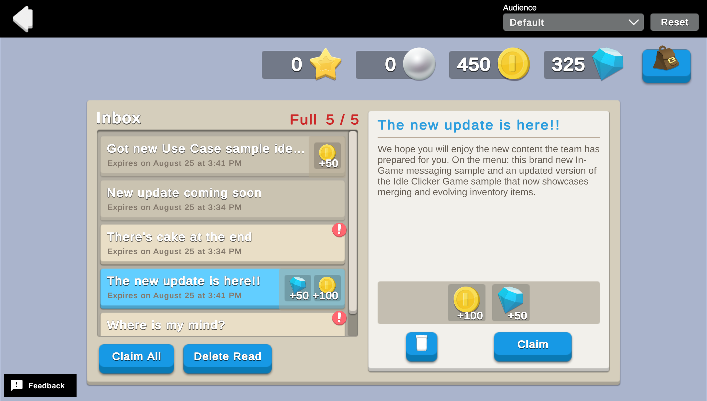

# In-Game Mailbox

In-game mailboxes are common mechanisms for game developers to communicate with their players.
You can use them to tell players about new in-game events, gift players items and currency, or to help retain players in the game.

## Overview

When a player loads the scene for the first time, they see an inbox with a list of messages waiting for them to read.
On subsequent loads, the inbox is either in the state they left it, or an updated state due to messages expiring between sessions.

Players can interact with the messages, claim their attachments, delete messages, or reset the inbox to a brand new state.

To see this use case in action:

1. In the Unity Editor **Project** window, select **Assets** > **Use Case Samples** > **In-Game Mailbox**, and then double-click `InGameMailboxSample.unity` to open the sample scene.
2. Enter **Play Mode** to interact with the use case.

### Initialization

When the scene loads, the `InGameMailboxSceneManager` script performs the following initialization steps:

1. Initializes Unity Gaming Services.
2. Signs in the player [anonymously](https://docs.unity.com/authentication/UsingAnonSignIn.html) using the Authentication service. If you’ve previously initialized any of the other sample scenes, Authentication will use your cached Player ID instead of creating a new one.
3. Refreshes the Economy configuration data. If new Economy items were created since the last time the player opened the app, this will initialize those items in the player's configuration.
4. Retrieves and updates currency balances from the Economy service for that authenticated user.
5. Uses the sprite addresses stored in the Economy item configuration's custom data to load all possible currency and inventory item sprites from Addressables.
6. Retrieves the updated message info for the player's inbox:
   1. Downloads the list of all possible messages from Remote Config.
   2. Retrieves the player's current inbox data from Cloud Save.
   3. Checks whether any of the messages already saved in the player's inbox are expired, and deletes them if so.
   4. Checks for any new messages that were downloaded from Remote Config and not yet added to the player's inbox.
   5. Saves the updated inbox state for the player in Cloud Save.
7. Displays the updated list of inbox messages in the scene.

### Functionality

The left panel in the scene displays the list of messages in the player's inbox.
This list updates over time as messages expire, or based on player interaction.

Below the list, a counter displays how many messages are in the inbox and the max number of messages that can be in the inbox at any given time.
When a player loads the scene for the first time, the inbox is full.

When all messages have been deleted from the inbox (either through player interaction or message expiration), a popup appears prompting the player to [reset the inbox](#reset-the-inbox-for-a-specific-audience). 

**Note**: This popup is a usability feature of the sample, and would not be an expected interaction in a real-world implementation.

#### Open a message

When you select a message from the list, the following occurs:

1. The full details of the message appears on the right side of the scene.
2. The message is marked as read, and that status is saved to Cloud Save.

If the message has an attachment, there is also an indication of which Economy items are attached, along with a button to claim them.

##### Claim an attachment

When you press the **Claim** button, the client code calls the `InGameMailbox_ClaimAttachment.js` Cloud Code script with the selected message's ID included as a parameter. The following occurs on the backend:

1. The client requests the Cloud Save inbox data, and locates the message with the supplied ID.
2. The script checks whether the message has an unclaimed attachment.
3. Assuming the message does have an unclaimed attachment, the script makes an Economy `makeVirtualPurchase` call using the Virtual Purchase ID from the `message.messageInfo.attachment` field.
4. If the purchase processes successfully, the `message.metadata.hasUnclaimedAttachment` field is set to `false` and saved in Cloud Save, so that the player cannot claim the attachment again.

#### Delete a message

When you press the delete button for a message:

1. The message is removed from the local list of inbox messages.
2. If the inbox was previously full, such that deleting the message created space for a new message, the client rechecks the list of all possible messages downloaded from Remote Config against the message ID of the last message saved in Cloud Save to see if there are any new messages to add to the inbox. If there are, it adds as many of those messages to the inbox as will fit.
3. The updated list of inbox messages is then saved in Cloud Save.
4. Finally, the view refreshes to show the updated list. If the deleted message was previously selected, this also updates the UI to not display the deleted message's detail view.

#### Claim all attachments

When you press the **Claim All** button, the client code makes a call to the `InGameMailbox_ClaimAllAttachments.js` Cloud Code script. The following occurs on the backend:

1. The client requests inbox data from Cloud Save.
2. Cloud Save returns a list of inbox messages filtered to only show messages with `message.metadata.hasUnclaimedAttachment` set to `true`.
3. For each message in this filtered list:
   1. The script makes an Economy `makeVirtualPurchase` call using the Virtual Purchase ID from the `message.messageInfo.attachment` field.
   2. If the purchase processes successfully, `message.metadata.hasUnclaimedAttachment` is set to `false`, and `message.metadata.isRead` is set to `true`.
4. Once all message attachments are claimed, the updated message list is saved in Cloud Save.
   
**Note**: Saving changes in Cloud Save after each attachment is claimed would make the process more fault tolerant. However, it would also require more server calls and therefore be less efficient than the selected approach. It is up to the developer which advantage to prioritize.

#### Delete all read and claimed attachments

When you press the **Delete Read** button:

1. The script loops through the list of inbox messages, and removes each message that has both `message.metadata.isRead` set to `true` and `message.metadata.hasUnclaimedAttachment` set to `false`. This implementation does not delete messages with unclaimed attachments, to prevent players from accidentally deleting messages with available attachments.
2. If the inbox was previously full, such that deleting the message created space for a new message, the client rechecks the list of all possible messages downloaded from Remote Config against the message ID of the last message saved in Cloud Save to see if there are any new messages to add to the inbox. If there are, it adds as many of those messages to the inbox as will fit.
3. The updated list of inbox messages is then saved in Cloud Save.
4. Finally, the view refreshes to show the updated list. If the deleted message was previously selected, this also updates the UI to not display the deleted message's detail view.

#### Reset the inbox for a specific audience

At the bottom of the scene, you can reset the inbox while impersonating a particular audience:

* `Default`
* `All Spenders`
* `Unengaged Players`
* `French Speakers`
* `New Players`

Each of the non-default audiences adds a message to the message list that is specific to that particular audience. These messages are determined by Game Overrides.

When you reset the inbox for the given audience, the following occurs:

1. The scene resets, clearing the selected message field and deleting the Cloud Save inbox data.
2. The client queries Remote Config with the specified audience, to retrieve the list of potential messages that includes any audience specific ones that were previously omitted.
3. The maximum number of messages are added to the inbox from the Remote Config data, and saved in Cloud Save.
4. The view refreshes to show the new list of messages.

#### Open the inventory

When you press the inventory bag icon, the following occurs:

1. The client calls `EconomyService.Instance.PlayerInventory.GetInventoryAsync()` to refresh the player's list of owned Economy inventory items.
2. A pop-up window displays the resulting list of inventory items.

## Setup

### Requirements

To replicate this use case, you need the following [Unity packages](https://docs.unity3d.com/Manual/Packages.html) in your project:

| **Package**                                                                                                            | **Role**                                                                                                                                                                                                                                                                                                                                                               |
|------------------------------------------------------------------------------------------------------------------------|------------------------------------------------------------------------------------------------------------------------------------------------------------------------------------------------------------------------------------------------------------------------------------------------------------------------------------------------------------------------|
| [Addressables](https://docs.unity3d.com/Packages/com.unity.addressables@latest)                                        | Allows developers to retrieve an asset by using its address. In this sample, the service looks up Economy item sprites based on the information stored in the Economy item's custom data.                                                                                                                                                                              |
| [Authentication](https://docs.unity.com/authentication/IntroUnityAuthentication.html)                                  | Automatically signs in the user anonymously to keep track of their data server-side.                                                                                                                                                                                                                                                                                   |
| [Cloud Code](https://docs.unity.com/cloud-code/implementation.html)                                                    | Stores important validation logic server-side. In this use case it is used to validate that message attachments haven't already been claimed, and to process the virtual purchase that stores the attachment rewards.                                                                                                                                                  |
| [Cloud Save](https://docs.unity.com/cloud-save/index.html#Implementation)                                              | Stores the player's inbox state, including the message info downloaded from Remote Config, and the player-specific message metadata like whether the message has been read yet.                                                                                                                                                                                        |
| [Economy](https://docs.unity.com/economy/implementation.html)                                                          | Maintains the player's wallet and inventory, and the virtual purchase info associated with a given message's attachment.                                                                                                                                                                                                                                               |
| [Game Overrides](https://docs.unity3d.com/Packages/com.unity.remote-config@3.2/manual/GameOverridesAndSettings.html)\* | Defines the audience grouping and message data for those messages that we want to only send to a certain audience.                                                                                                                                                                                                                                                     |
| [Remote Config](https://docs.unity3d.com/Packages/com.unity.remote-config@latest)                                      | Provides key-value pairs where the value that is mapped to a given key can change on the server side, either manually or based on specific Game Overrides. In this sample, we store the message info in Remote Config, and for messages that should only be sent to a particular audience, we store them as blank messages (they'll get filled in by Game Overrides).  |

\* Note that though it is listed as a package and requires separate dashboard configuration, Game Overrides doesn't actually have an SDK to install from Package Manager. It is a server side offering that affects values returned from other services, like Remote Config.

To use these services in your game, activate each service for your Organization and project in the [Unity Dashboard](https://dashboard.unity3d.com/).

### Dashboard setup

To replicate this sample scene's setup on your own dashboard, you need to:

- Publish two scripts in Cloud Code.
- Create two Currencies, two Inventory Items, and several Virtual Purchases for the Economy service.
- Configure values and Game Overrides for the Remote Config service.

#### Cloud Code

[Publish the following scripts](https://docs.unity.com/cloud-code/implementation.html#Writing_your_first_script) in the **LiveOps** dashboard:

| **Script**                          | **Parameters**                                                                                               | **Description**                                                                                                                                                                                                                     | **Location in project**                                                                   |
|-------------------------------------|--------------------------------------------------------------------------------------------------------------|-------------------------------------------------------------------------------------------------------------------------------------------------------------------------------------------------------------------------------------|-------------------------------------------------------------------------------------------|
| `InGameMailbox_ClaimAttachment`     | `messageId`  `STRING`  The id of the message that owns the attachment the player wants to claim. | Fetches the appropriate attachment for the given message, validates that the attachment hasn't already been claimed, calls Economy's process purchase method for that Virtual Purchase, and marks the attachment as claimed.        | `Assets/Use Case Samples/In-Game Mailbox/Cloud Code/InGameMailbox_ClaimAttachment.js`     |
| `InGameMailbox_ClaimAllAttachments` | none                                                                                                         | Gets the list of messages in a player's inbox, finds all messages that have an unclaimed attachment, and calls Economy's process purchase method for each Virtual Purchase, marking each message as read and attachment as claimed. | `Assets/Use Case Samples/In-Game Mailbox/Cloud Code/InGameMailbox_ClaimAllAttachments.js` |

**Note**: The Cloud Code scripts included in the `Cloud Code` folder are local copies because you cannot view the sample project's dashboard. Changes to these scripts do not affect the behavior of this sample because they are not automatically uploaded to the Cloud Code service.

#### Economy

[Configure the following resources](https://docs.unity.com/economy/) in the **LiveOps** dashboard:

| **Resource type** | **Resource item** | **ID**    | **Custom Data**                                   | **Description**                             |
|-------------------|-------------------|-----------|---------------------------------------------------|---------------------------------------------|
| Currency          | Gem               | `GEM`     | `{ "spriteAddress": "Sprites/Currency/Gem" }`     | A premium currency gifted by some messages. |
| Currency          | Coin              | `COIN`    | `{ "spriteAddress": "Sprites/Currency/Coin" }`    | A soft currency gifted by some messages.    |
| Inventory Item    | Sword             | `SWORD`   | `{ "spriteAddress": "Sprites/Inventory/Sword" }`  | An inventory item gifted by some messages.  |
| Inventory Item    | Shield            | `SHIELD`  | `{ "spriteAddress": "Sprites/Inventory/Shield" }` | An inventory item gifted by some messages.  |

In addition, [configure the following virtual purchases](https://docs.unity.com/economy/item-types.html#Virtual_purchase):

| **Item name**                          | **ID**                         | **This purchase rewards**         | **This purchase costs** |
|----------------------------------------|--------------------------------|-----------------------------------|-------------------------|
| Message 003 Gift for New Players       | `MESSAGE_003_GIFT_NEW_PLAYERS` | Sword (1), Shield (1), Coin (100) | none                    |
| Message 004 Gift for Unengaged Players | `MESSAGE_004_GIFT_UNENGAGED`   | Gem   (50)                        | none                    |
| Message 005 Gift                       | `MESSAGE_005_GIFT`             | Coin  (50)                        | none                    |
| Message 008 Gift                       | `MESSAGE_008_GIFT`             | Coin  (100), Gem (50)             | none                    |
| Message 010 Gift                       | `MESSAGE_010_GIFT`             | Gem   (50)                        | none                    |
| Message 011 Gift                       | `MESSAGE_011_GIFT`             | Sword (1)                         | none                    |

\* There is no cost associated with these Virtual Purchases because they are all gifts to the player reading the message. 

#### Remote Config

[Set up the following config values](https://docs.unity.com/remote-config/HowDoesRemoteConfigWork.html) in the **LiveOps** dashboard:

| **Key**        | **Type** | **Description**                                                                                                                        | **Value**                                                                                                                                                                                                                                                                                                                                                                                          |
|----------------|----------|----------------------------------------------------------------------------------------------------------------------------------------|----------------------------------------------------------------------------------------------------------------------------------------------------------------------------------------------------------------------------------------------------------------------------------------------------------------------------------------------------------------------------------------------------|
| `MESSAGES_ALL` | JSON     | The JSON list of all possible message ids that exist in the Remote Config dashboard, listed in the order they should be downloaded in. | {<ul> `"messageList"`: [<ul>"MESSAGE_001", "MESSAGE_002", "MESSAGE_003", "MESSAGE_004", "MESSAGE_005", "MESSAGE_006", "MESSAGE_007", "MESSAGE_008", "MESSAGE_009", "MESSAGE_010", "MESSAGE_011"</ul>]</ul>}                                                                                                                                                |
| `MESSAGE_001`  | JSON     | One of the messages that a player could receive.                                                                                       | {<ul> `"title"`: "", `"content"`: "", `"attachment"`: "", `"expiration"`: "0.00:03:00.00" </ul>}                                                                                                                                                                                                                                                                                   |
| `MESSAGE_002`  | JSON     | One of the messages that a player could receive.                                                                                       | {<ul> `"title"`: "", `"content"`: "", `"attachment"`: "", `"expiration"`: "0.00:03:00.00" </ul>}                                                                                                                                                                                                                                                                                   |
| `MESSAGE_003`  | JSON     | One of the messages that a player could receive.                                                                                       | {<ul> `"title"`: "", `"content"`: "", `"attachment"`: "", `"expiration"`: "0.00:03:00.00" </ul>}                                                                                                                                                                                                                                                                                   |
| `MESSAGE_004`  | JSON     | One of the messages that a player could receive.                                                                                       | {<ul> `"title"`: "", `"content"`: "", `"attachment"`: "", `"expiration"`: "0.00:03:00.00" </ul>}                                                                                                                                                                                                                                                                                   |
| `MESSAGE_005`  | JSON     | One of the messages that a player could receive.                                                                                       | {<ul> `"title"`: "Got new Use Case sample ideas?", `"content"`: "We’d love to hear your suggestions about what kind of new samples you would like us to deliver. Let us know at headstart@unity3d.com", `"attachment"`: "MESSAGE_005_GIFT", `"expiration"`: "0.00:10:00.00" </ul>}                                                                                                 |
| `MESSAGE_006`  | JSON     | One of the messages that a player could receive.                                                                                       | {<ul> `"title"`: "New update coming soon", `"content"`: "Our next update will be released soon and will require a client update from the App Store or Google Play Store. No, that’s a joke. Our samples are only available on Github for now ;)", `"attachment"`: "", `"expiration"`: "0.00:03:00.00" </ul>}                                                                       |
| `MESSAGE_007`  | JSON     | One of the messages that a player could receive.                                                                                       | {<ul> `"title"`: "There's cake at the end", `"content"`: "The cake is a lie.", `"attachment"`: "", `"expiration"`: "0.00:03:00.00" </ul>}                                                                                                                                                                                                                                          |
| `MESSAGE_008`  | JSON     | One of the messages that a player could receive.                                                                                       | {<ul> `"title"`: "The new update is here!!", `"content"`: "We hope you will enjoy the new content the team has prepared for you. On the menu: this brand new In-Game messaging sample and an updated version of the Idle Clicker Game sample that now showcases merging and evolving inventory items.", `"attachment"`: "MESSAGE_008_GIFT", `"expiration"`: "0.00:10:00.00" </ul>} |
| `MESSAGE_009`  | JSON     | One of the messages that a player could receive.                                                                                       | {<ul> `"title"`: "Where is my mind?", `"content"`: "This is a very uninspired and uninspiring message. Our apologies.", `"attachment"`: "", `"expiration"`: "0.00:03:00.00" </ul>}                                                                                                                                                                                                 |
| `MESSAGE_010`  | JSON     | One of the messages that a player could receive.                                                                                       | {<ul> `"title"`: "Server Downtime", `"content"`: "Our servers were offline for 2 hours yesterday for unexpected reasons. Please accept our apologies and this gift as a compensation. Of course, this is only for illustration purposes; UGS Use Case samples are never offline!", `"attachment"`: "MESSAGE_010_GIFT", `"expiration"`: "0.00:10:00.00" </ul>}                      |
| `MESSAGE_011`  | JSON     | One of the messages that a player could receive.                                                                                       | {<ul> `"title"`: "It's dangerous to go alone", `"content"`: "Take this!", `"attachment"`: "MESSAGE_011_GIFT", `"expiration"`: "0.00:10:00.00" </ul>}                                                                                                                                                                                                                               |

#### Game Overrides

[Configure the following Overrides](https://docs.unity.com/gameoverrides/CreateAnOverride.html) in the **LiveOps** dashboard:

| **Details**    | Name the Override “Messages All Spenders Overrides”.                                                                                                                                                                                                                                                                                                                                                                                             |
|----------------|--------------------------------------------------------------------------------------------------------------------------------------------------------------------------------------------------------------------------------------------------------------------------------------------------------------------------------------------------------------------------------------------------------------------------------------------------|
| **Targeting**  | Select **Stateless JEXL** with the following JEXL code: user.audience == "AllSpenders" (See **Note**, below)                                                                                                                                                                                                                                                                                                                                 |
| **Content**    | Select **Choose content type** > **Config Overrides**, then enter override values for the following keys: <ul><li>`MESSAGE_001`: </li><ul>{<ul>`"title"`: "Thank you for supporting us!", `"content"`: "This message specifically targets Spender players, thanks to Game Overrides that enables other Unity services to target pre-defined or custom audiences.", `"attachment"`: "", `"expiration"`: "0.00:03:00.00" </ul>} |
| **Scheduling** | Set the following start and end dates:<ul><li>Set **Start Date** to **Update content immediately**.</li><li>Set **End Date** to **Run indefinitely**.</li></ul>                                                                                                                                                                                                                                                                                  |

| **Details**    | Name the Override “Messages French Speaker Overrides”.                                                                                                                                                                                                                                                                                                                                                                                                                                                                                       |
|----------------|----------------------------------------------------------------------------------------------------------------------------------------------------------------------------------------------------------------------------------------------------------------------------------------------------------------------------------------------------------------------------------------------------------------------------------------------------------------------------------------------------------------------------------------------|
| **Targeting**  | Select **Stateless JEXL** with the following JEXL code: user.audience == "FrenchSpeakers" (See **Note**, below)                                                                                                                                                                                                                                                                                                                                                                                                                          |
| **Content**    | Select **Choose content type** > **Config Overrides**, then enter override values for the following keys: <ul><li>`MESSAGE_002`: </li><ul>{<ul>`"title"`: "Oh oui, le message!", `"content"`: "Et oui, ce message est en français car il cible les joueurs dont la langue du jeu est paramétrée en français. Ceci est rendu possible grâce à Game Overrides qui permet à certains services de Unity  de cibler des audiences pré-définies ou personnalisées.", `"attachment"`: "", `"expiration"`: "0.00:03:00.00" </ul>} |
| **Scheduling** | Set the following start and end dates:<ul><li>Set **Start Date** to **Update content immediately**.</li><li>Set **End Date** to **Run indefinitely**.</li></ul>                                                                                                                                                                                                                                                                                                                                                                              |

| **Details**    | Name the Override “Messages New Players Overrides”.                                                                                                                                                                                                                                                                                                                                                                                                              |
|----------------|------------------------------------------------------------------------------------------------------------------------------------------------------------------------------------------------------------------------------------------------------------------------------------------------------------------------------------------------------------------------------------------------------------------------------------------------------------------|
| **Targeting**  | Select **Stateless JEXL** with the following JEXL code: user.audience == "NewPlayers" (See **Note**, below)                                                                                                                                                                                                                                                                                                                                                  |
| **Content**    | Select **Choose content type** > **Config Overrides**, then enter override values for the following keys: <ul><li>`MESSAGE_003`: </li><ul>{<ul>`"title"`: "Welcome to the game!", `"content"`: "This message specifically targets New Players, thanks to Game Overrides that enables other Unity services to target pre-defined or custom audiences.", `"attachment"`: "MESSAGE_003_GIFT_NEW_PLAYERS", `"expiration"`: "0.00:10:00.00" </ul>} |
| **Scheduling** | Set the following start and end dates:<ul><li>Set **Start Date** to **Update content immediately**.</li><li>Set **End Date** to **Run indefinitely**.</li></ul>                                                                                                                                                                                                                                                                                                  |

| **Details**    | Name the Override “Messages Unengaged Players Overrides”.                                                                                                                                                                                                                                                                                                                                                                                                                |
|----------------|--------------------------------------------------------------------------------------------------------------------------------------------------------------------------------------------------------------------------------------------------------------------------------------------------------------------------------------------------------------------------------------------------------------------------------------------------------------------------|
| **Targeting**  | Select **Stateless JEXL** with the following JEXL code: user.audience == "UnengagedPlayers" (See **Note**, below)                                                                                                                                                                                                                                                                                                                                                    |
| **Content**    | Select **Choose content type** > **Config Overrides**, then enter override values for the following keys: <ul><li>`MESSAGE_004`: </li><ul>{<ul>`"title"`: "Welcome back to the game!", `"content"`: "This message specifically targets Unengaged players, thanks to Game Overrides that enables other Unity services to target pre-defined or custom audiences.", `"attachment"`: "MESSAGE_004_GIFT_UNENGAGED", `"expiration"`: 0.00:10:00.00" </ul>} |
| **Scheduling** | Set the following start and end dates:<ul><li>Set **Start Date** to **Update content immediately**.</li><li>Set **End Date** to **Run indefinitely**.</li></ul>                                                                                                                                                                                                                                                                                                          |

**Important**: After configuring your Overrides, remember to enable them by selecting the Override from the list and clicking the **Enable** button.  

**Note**: This sample determines which Game Override data should be returned based on a JEXL match with the audience value specified in the client. This is so that the use case can fake a player being in different audiences on demand. In a real app, the Game Overrides would likely be set up to use built-in or custom-defined Analytics audiences for targeting (i.e. during Game Override's targeting step, choose `Stateful (Audiences)` and check the appropriate analytics audience from the list or click `Build a new Audience`).  
