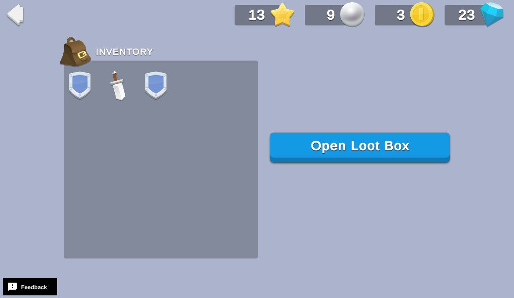

# Loot Boxes With Cooldown

Whether they're receiving items, currencies, extra lives, or power-ups, players love free stuff! Awarding daily gifts to players that return to your game boosts engagement, intrinsic motivation to check in regularly, and overall interest in your game. Daily rewards can also act as a precursor to introducing monetized in-app purchases in the future.

This sample demonstrates how to grant randomized rewards on a timed cooldown. After a player claims their reward, they must wait a preset amount of time before claiming another reward.

## Overview

To see this use case in action:
1. In the Unity Editor **Project** window, select **Assets**.
2. Double-click `Start Here.unity` to open the samples menu scene.
3. Enter **Play Mode**.
4. Click **Loot Boxes with Cooldown** to interact with this use case.

### Initialization

1. The `DailyRewardsSceneManager` script initializes Unity Gaming Services in its `Start` function.
2. The game retrieves and updates values from the Economy service.

### Functionality

When you click the **Claim Daily Reward** button, you receive a random amount of rewards from the available pool (indicated in the currency HUD). For demonstration purposes, the cooldown is set to 60 seconds. The following occurs on the backend:
1. The button's `OnClick` method calls Cloud Code to execute the `GrantTimedRandomReward` function, which picks random currencies and inventory items from internal lists to award.
2. The Economy service directly grants the reward and returns the final results to the calling Unity C# script.

This example also uses Cloud Code to access Cloud Save to implement a cooldown between rewards and returns:
- A flag if the **Claim Daily Rewards** button should be enabled.
- The current cooldown in seconds.
- The default cooldown needed to reset the timer locally when a reward is claimed.

**Note**: This sample also includes enhanced error handling to catch and resolve issues that arise from calling the Economy service too frequently (more than five times per second), which triggers theEconomyException exception with the RateLimited reason. This sample catches the exception, pauses .1 seconds with exponential back-off, and then retries until it succeeds.

## Setup

### Requirements

To replicate this use case, you need the following [Unity packages](https://docs.unity3d.com/Manual/Packages.html) in your project:

| **Package**                                                                           | **Role**                                                                                                                                                   |
|---------------------------------------------------------------------------------------|------------------------------------------------------------------------------------------------------------------------------------------------------------|
| [Authentication](https://docs.unity.com/authentication/IntroUnityAuthentication.html) | Automatically signs in the player as an anonymous user to keep track of their data server-side.                                                            |
| [Cloud Code](https://docs.unity.com/cloud-code/implementation.html)                   | Accesses the cooldown status, picks and grants random currency and inventory items through the Economy server, and then returns the result of the reward.  |
| [Cloud Save](https://docs.unity.com/cloud-save/index.html#Implementation)             | Stores and retrieves the last granted reward time to allow cooldown values to persist between sessions.                                                    |
| [Economy](https://docs.unity.com/economy/implementation.html)                         | Retrieves the starting and updated currency balances at runtime.                                                                                           |

To use these services in your game, activate each service for your Organization and project in the [Unity Dashboard](https://dashboard.unity3d.com/).

### Dashboard setup

To replicate this sample scene's setup on your own dashboard, you need to:
- Publish two scripts in Cloud Code.
- Create four Currencies and two Inventory Items for the Economy service.

#### Cloud Code

[Publish the following scripts](https://docs.unity.com/cloud-code/implementation.html#Writing_your_first_script) in the **LiveOps** dashboard:

| **Script**                         | **Parameters** | **Description**                                                                                                                                                                  | **Location in project**                                                                          |
|------------------------------------|----------------|----------------------------------------------------------------------------------------------------------------------------------------------------------------------------------|--------------------------------------------------------------------------------------------------|
| `LootBoxesWithCooldown_Claim`      | None           | Checks if the cooldown has expired (or was never set), then selects a random reward from the reward pool, grants the reward to the player, and then updates the cooldown timer.  | `Assets/Use Case Samples/Loot Boxes With Cooldown/Cloud Code/LootBoxesWithCooldown_Claim.js`     |
| `LootBoxesWithCooldown_GetStatus`  | None           | Checks for the last grant time and returns a flag indicating if the player is eligible for a reward, and how many seconds are left in cooldown.                                  | `Assets/Use Case Samples/Loot Boxes With Cooldown/Cloud Code/LootBoxesWithCooldown_GetStatus.js` |
**Note**: The Cloud Code scripts included in theCloud Code folder are local copies because you cannot view the sample project's dashboard. Changes to these scripts do not affect the behavior of this sample because they are not automatically uploaded to the Cloud Code service.**

#### Economy

[Configure the following resources](https://docs.unity.com/economy/) in the **LiveOps** dashboard:

| **Resource type** | **Resource name** | **ID**     | **Description**                                             |
|-------------------|-------------------|------------|-------------------------------------------------------------|
| Currency          | Coin              | `COIN`     | A currency for the randomized loot box reward pool.         |
| Currency          | Gem               | `GEM`      | A currency for the randomized loot box reward pool.         |
| Currency          | Pearl             | `PEARL`    | A currency for the randomized loot box reward pool.         |
| Currency          | Star              | `STAR`     | A currency for the randomized loot box reward pool.         |
| Inventory item    | Sword             | `SWORD`    | An inventory item for the randomized loot box reward pool.  |
| Inventory item    | Shield            | `SHIELD`   | An inventory item for the randomized loot box reward pool.  |
