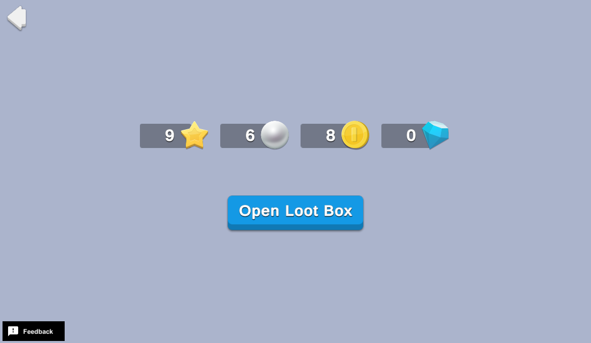

# Loot Boxes

Loot boxes are virtual items that players can win, earn, or purchase, and then open to receive a randomized selection of items. Rewards can vary greatly depending on the game's genre, theme, and virtual economy. They can positively impact retention, supplement live events, and pique the curiosity of old and new players alike.

This sample demonstrates how to set up a basic loot box that grants random currency to players.

## Overview

To see this use case in action:

1. In the Unity Editor **Project** window, select **Assets** > **Use Case Samples** > **Loot Boxes**, and then double-click `LootBoxesSample.unity` to open the sample scene.
2. Enter Play Mode to interact with the use case.

### Initialization

The `LootBoxesSceneManager.cs` script performs the following initialization tasks:

1. Initializes Unity Gaming Services.
2. Signs in the player [anonymously](https://docs.unity.com/authentication/UsingAnonSignIn.html) using the Authentication service. If you’ve previously initialized any of the other sample scenes, Authentication will use your cached Player ID instead of creating a new one.
3. Retrieves and updates currency balances from the Economy service for that authenticated user.

### Functionality

When you click the **Open Loot Box** button, you receive a random amount of rewards from the available pool (indicated in the currency HUD). The following occurs on the backend:

1. The button's `OnClick` method calls the `GetRandomCurrency` script from the Cloud Code service, which picks a random quantity of a random currency from an internal list to reward the user.
2. Cloud Code calls the Economy service directly to grant the awarded currency and update the player's balance.
3. Cloud Code returns the results to the client and updates the UI.

## Setup

### Requirements

To replicate this use case, you need the following [Unity packages](https://docs.unity3d.com/Manual/Packages.html) in your project:

| **Package**                                                                           | **Role**                                                                                             |
|---------------------------------------------------------------------------------------|------------------------------------------------------------------------------------------------------|
| [Authentication](https://docs.unity.com/authentication/IntroUnityAuthentication.html) | Automatically signs in the player as an anonymous user to keep track of their data server-side.      |
| [Cloud Code](https://docs.unity.com/cloud-code/implementation.html)                   | Picks and grants random currency for the loot box through the Economy server and returns the result. |
| [Economy](https://docs.unity.com/economy/implementation.html)                         | Retrieves the starting and updated currency balances at runtime.                                     |

To use these services in your game, activate each service for your Organization and project in the [Unity Dashboard](https://dashboard.unity3d.com/).

### Dashboard setup

To replicate this sample scene's setup on your own dashboard, you need to:

- Publish one script in Cloud Code.
- Create four Currencies for the Economy service.

#### Cloud Code

[Publish the following script](https://docs.unity.com/cloud-code/implementation.html#Writing_your_first_script) in the **LiveOps** dashboard:

| **Script**                      | **Parameters** | **Description**                                                                                                                                  | **Location in project**                                                          |
|---------------------------------|----------------|--------------------------------------------------------------------------------------------------------------------------------------------------|----------------------------------------------------------------------------------|
| `LootBoxes_GrantRandomCurrency` | None           | Picks a random quantity of a random currency from an internal list to reward the user, grants it on the Economy service, and returns the result. | `Assets/Use Case Samples/Loot Boxes/Cloud Code/LootBoxes_GrantRandomCurrency.js` |

**Note**: The Cloud Code scripts included in theCloud Code folder are local copies because you cannot view the sample project's dashboard. Changes to these scripts do not affect the behavior of this sample because they are not automatically uploaded to the Cloud Code service.

#### Economy

[Configure the following resources](https://docs.unity.com/economy/) in the **LiveOps** dashboard:

| **Resource type** | **Resource name** | **ID**  | **Description**              |
|-------------------|-------------------|---------|------------------------------|
| Currency          | Coin              | `COIN`  | A potential loot box reward. |
| Currency          | Gem               | `GEM`   | A potential loot box reward. |
| Currency          | Pearl             | `PEARL` | A potential loot box reward. |
| Currency          | Star              | `STAR`  | A potential loot box reward. |
