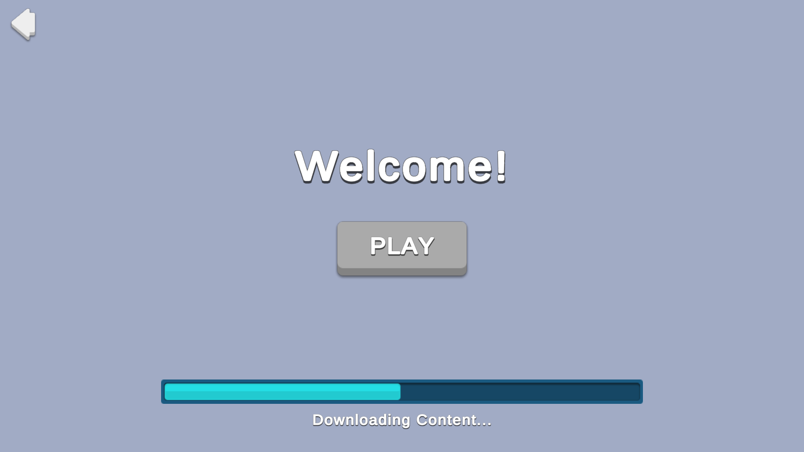

# Over-The-Air Content Delivery

When you want to add new content to your game, releasing a new version of your application that users
must then install before they can play can result in a poor user experience. As an alternative, you
can use an Over the Air Content approach, so that the player can open the application and begin
interacting with the game while new content downloads in the background or during idle times.

This sample uses a menu screen to download and install new content without leaving the game.

## Overview

This sample demonstrates how to download new content from the cloud while the game is running.
The client pings the Remote Config service, which informs the client that there is new content, and where to get it.

**Note**: This sample primarily uses Addressables with Cloud Content Delivery to add new content to a game while it is running.
The Remote Config, Economy, and Cloud Code service functions used are not strictly required for the content delivery part to work.

### Initialization

When the scene loads, the `OverTheAirContentSceneManager.cs` script performs the following initialization tasks:

1. Initializes Unity Gaming Services.
2. Signs in the player [anonymously](https://docs.unity.com/authentication/UsingAnonSignIn.html) using the Authentication service.
If you’ve previously initialized any of the other sample scenes,
Authentication will use your cached Player ID instead of creating a new one.
3. Downloads all configuration data from Remote Config, some of which is necessary to detect and download new content.

### Usage

When the scene loads, you'll see a **Begin** button.
When you press it, an interstitial screen appears, and the new content automatically begins downloading.
When the download completes, you can click the **Play** button to continue to view and interact with the new content.

You can click one of the two **Restart Sample** buttons to return to the beginning.
If you choose to clear the cache, the sample will download the content again from Cloud Content Delivery.

## Setup

### Requirements

To replicate this use case, you need the following [Unity packages](https://docs.unity3d.com/Manual/Packages.html) in your project:

| **Package**                                                                           | **Role**                                                                                                                                                                                                                          |
|---------------------------------------------------------------------------------------|-----------------------------------------------------------------------------------------------------------------------------------------------------------------------------------------------------------------------------------|
| [Addressables](https://docs.unity3d.com/Packages/com.unity.addressables@latest)       | Allows developers to retrieve an asset by using its address. In this sample, the service looks up event-specific images and prefabs based on the information received from Remote Config.                                         |
| [Authentication](https://docs.unity.com/authentication/IntroUnityAuthentication.html) | Automatically signs in the user anonymously to keep track of their data server-side.                                                                                                                                              |
| [Cloud Content Delivery (CCD)](https://docs.unity.com/ccd/UnityCCD.html) \*           | Hosts the content asset bundle of the new content.                                                                                                                                                                                |
| [Remote Config](https://docs.unity3d.com/Packages/com.unity.remote-config@latest)     | Provides key-value pairs where the value that is mapped to a given key can change on the server side, either manually or based on specific Game Overrides. In this sample, we use it to inform the client of new content updates. |

\* Note that though it is listed as a package and requires separate dashboard configuration, the Cloud Content Delivery package doesn't need to be installed in your project. It hosts the content asset bundle, but Addressables is used to download the content in the project.

To use these services in your game, activate each service for your Organization and project in the [Unity Dashboard](https://dashboard.unity3d.com/).

### Dashboard setup

To replicate this sample scene's setup on your own dashboard, you need to:
- Upload an Addressables build (catalog and asset bundle) to a Cloud Content Delivery bucket.
- Configure values for the Remote Config service (see below for values).

#### Cloud Content Delivery

You can use Addressables to build asset bundles (and optionally content catalogs),
which can then be uploaded to CCD and downloaded by your game.
This process isn't detailed in this document, but you can learn about it in
[the CCD + Addressables walkthrough tutorial](https://docs.unity.com/ccd/UnityCCDWalkthrough.html).

It's very common to use Addressables and CCD from a single project.
However, this example demonstrates a multi-project setup.
Developers with medium or large teams might use the latter approach for a number of reasons:

* Reduce iteration time by making the main project smaller.
* Segment different types of work across multiple teams using smaller projects.
* Enable user-generated content.

This example uses an optional multi-project setup.
One Unity project is the main project that downloads new content at runtime,
while a separate Unity project builds new content into asset bundles for the main project to download.
The main project only knows about new content built with the second project when the Remote Config service informs it.

**Note**: When you cloned or downloaded this project, you likely got the `main` branch.
This branch contains the main project, which downloads new content from CCD.
To see how that downloadable content is created, see the `ota-content`
[branch of this GitHub repo](https://github.com/Unity-Technologies/com.unity.services.samples.use-cases/tree/ota-content).
It has additional Addressables configurations needed for creating the asset bundles.
You can explore the differences in the `AddressableAssetSettings` file, the **Addressables Groups** window, and the **Addressables Profiles** window.

To make the multiple-project setup work, you'll need to upload a remote catalog along with your asset bundles.
In your content build project:

* Select the `AddressableAssetSettings` asset to view it in the Inspector window.
* Make sure the `Build Remote Catalog` option is enabled.
* Perform your Addressables build.

In the resulting build folder, there will be a catalog JSON file and a catalog hash file.
Upload both files to your CCD bucket along with the related asset bundles.

After you've uploaded an Addressables build to a CCD bucket,
make notes of a few things that you'll use in the Remote Config settings:

* The "Addressable Remote Path URL" for the bucket (found in the bucket page of the dashboard).
* The name of the content catalog JSON file.
* The addresses of any assets you want to download.

##### Setting up your own content creation

If you want to set up your own content creation workflow using Addressables and CCD, please have a look at these other learning resources:
* [CCD + Addressables walkthrough using the Loady Dungeons sample project](https://docs.unity.com/ccd/UnityCCDWalkthrough.html)
* [Managing catalogs at runtime](https://docs.unity3d.com/Packages/com.unity.addressables@1.20/manual/LoadContentCatalogAsync.html)
* [Loading from multiple projects](https://docs.unity3d.com/Packages/com.unity.addressables@1.20/manual/MultiProject.html) (optional)

#### Remote Config

[Set up the following config values](https://docs.unity.com/remote-config/HowDoesRemoteConfigWork.html) in the **LiveOps** dashboard:

| **Value**             | **Type** | **Description**                                                                                      | **Default value**                                                                                                                                                                                                                                                                                                                                            |
|---------------------- | -------- |----------------------------------------------------------------------------------------------------- | ------------------------------------------------------------------------------------------------------------------------------------------------------------------------------------------------------------------------------------------------------------------------------------------------------------------------------------------------------------ |
| `OTA_CATALOG_URL`     | string   | The URL for the Addressables catalog file in the CCD bucket.                                         | The bucket URL provided to you by the CCD dashboard, concatenated with the catalog json filename at the end. Example: `Something like: https://[YOUR_PROJECT_ID].client-api.unity3dusercontent.com/client_api/v1/environments/[YOUR_ENV_NAME]/buckets/[YOUR_BUCKET_ID]/release_by_badge/latest/entry_by_path/content/?path=catalog_YYYY.MM.DD.HH.MM.SS.json` |
| `OTA_CONTENT_UPDATES` | JSON     | Indicates that there is new content to download. Each entry represents a new value in Remote Config. | `{"updates": [{"configKey": "OTA_NEW_CONTENT"}]}`                                                                                                                                                                                                                                                                                                            |
| `OTA_NEW_CONTENT`     | JSON     | Information about the new content. In this case it's simple, but you could have lots of info here.   | `{"prefabAddress":"NewContentPrefab"}`                                                                                                                                                                                                                                                                                                                       |

**Note**: Every time you build and upload a new catalog file, you'll need to update the `OTA_CATALOG_URL` value in Remote Config to reflect the new filename.
If you use the **Update a Previous Build** option, you won't need to update the catalog URL in Remote Config.
