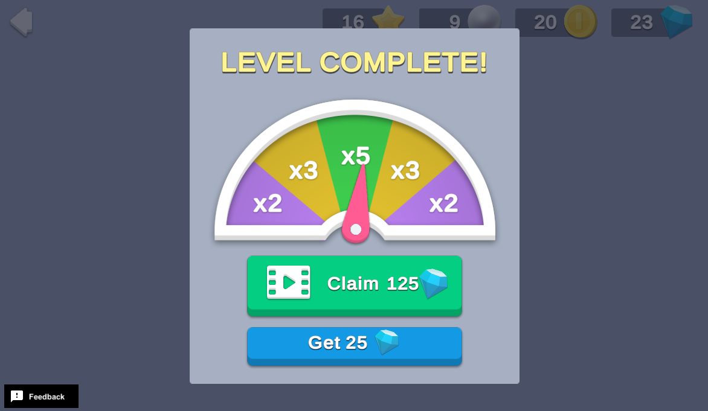

# Rewarded Ads with Unity Mediation

Incentivizing players to watch an ad can be a great way to increase your game's revenue.

This sample demonstrates how to offer players double rewards for completing a level if they choose to watch an ad. The sample further gamifies this feature by implementing a random chance for additional rewards. Every so often the player sees a meter with 2x, 3x, and 5x reward multipliers. Stopping the meter at the right time results in even greater incentives for viewing the ad. This makes rewarded ads more fun and tempting for players to interact with.

## Overview

To see this use case in action:
1. In the Unity Editor **Project** window, select **Assets**.
2. Double-click `Start Here.unity` to open the samples menu scene.
3. Enter **Play Mode**.
4. Click **Rewarded Ads with Unity Mediation** to interact with this use case.

**Note**: Unity Mediation only supports iOS and Android. If the project's build targets any other platform, the console will log warnings in Play mode when you attempt to initialize services. You can still interact with the sample, however, if you create a build for one of the unsupported platforms, ads will not show. To see the use case without warnings, [change the project's build target](https://docs.unity.com/ads/CreatingUnityProjects.html#Setting_build_targets_in_Unity) to iOS or Android.

### Initialization

The `RewardedAdsSceneManager.cs` script performs the following initialization tasks in its `Start` function:

1. Initializes Unity Gaming Services.
2. Signs in the player [anonymously](https://docs.unity.com/authentication/UsingAnonSignIn.html) using the Authentication service. If you’ve previously initialized any of the other sample scenes, Authentication will use your cached Player ID instead of creating a new one.
3. Retrieves and updates the player's currency balances from the Economy service.
4. Loads (pre-caches) the first ad from the Unity Mediation service.

### Functionality

The sample simulates completing a level by clicking a button. When you click the **Complete Level** button, the following occurs:

1. The button's `OnClick` method executes the `RewardedAdsSceneManager.cs` script's `OnCompleteLevelButtonPressed` function.
2. The `OnCompleteLevelButtonPressed` function determines whether to display the LEVEL COMPLETE! popup with or without the rewarded ad mini-game, and then increments the level count and disables the button's interactivity.

**Note**: The level count is stored in Cloud Save. In this sample, the mini-game is hardcoded to appear after the first level, and then every three levels thereafter. Depending on the level increment, the following scenarios can occur.

#### Double rewards incentive

In this scenario, the LEVEL COMPLETE! pop-up prompts you to either collect the standard 25 Gem reward or watch an ad to double the reward. If you click the **Get 25** button, you will receive 25 Gems, and then the popup will close and you can continue simulating levels. The following occurs:

1. The button's `OnClick` method executes the `RewardedAdsSceneManager.cs` script's `OnClaimLevelEndRewardsButtonPressed` function.
2. The `OnClaimLevelEndRewardsButtonPressed` function distributes the `baseRewardAmount` of the `rewardCurrencyId` configured in the `RewardedAds_GrantLevelEndRewards.js` Cloud Code script by using the Economy service.

If you click the **Claim 50** button, you will receive the standard amount of Gems (25), and then receive another 25 upon finishing the ad. When you dismiss the ad, the popup will close and you can continue simulating levels. The following occurs on the backend:

1. The button's `OnClick` method executes the `RewardedAdsSceneManager.cs` script's `OnWatchRewardedAdButtonPressed` function, which calls the `RewardedAds_GrantLevelEndRewards.js` Cloud Code script to distribute the specified `baseRewardAmount` of the `rewardCurrencyId` through the Economy service. This ensures that the player receives the standard level completion rewards, even if they close the ad prematurely.
2. The `OnWatchRewardedAdButtonPressed` function calls the `MediationManager.cs` script's `ShowAd` function, which uses the Unity Mediation service to show the pre-cached ad. As soon as the ad successfully begins to play, the script requests another ad to cache. This gives the ad time to load and be ready for the next interaction.
3. The `ShowAd` function takes an integer argument for the additional currency to grant (in this case, the `standardRewardedAdMultiplier`). If the result callback indicates that the player finished viewing the ad, the bonus currency is allocated by using the Economy service.

**Note**: You can close the test ad before it's finished to simulate skipping the ad and therefore the reward. In this case, the client does not call the Cloud Code script a second time to distribute bonus rewards.

**Important**: You will only see placeholder ad creatives in the Unity Editor. If you build this project to a device, you must [enable test mode](https://docs.unity.com/ads/TestingAdsIntegration.html) to prevent the Unity Ads SDK from serving live ads, which could lead to your account being flagged or suspended for fraud.

#### Rewards multiplier mini-game

In this scenario, the **LEVEL COMPLETE!** pop-up prompts you to collect the standard 25 Gem reward, or click a special **Claim** button that stops an arrow oscillating between 2x, 3x, or 5x panels on a meter. The multiplier you land on applies to the rewards you receive for watching an ad. What you stop the meter, the following occurs:

1. The button's `OnClick` method executes the `RewardedAdsSceneManager.cs` script's `OnMiniGameWatchRewardedAdButtonPressed` function.
2. The `OnMiniGameWatchRewardedAdButtonPressed` function distributes the `baseRewardAmount` of the `rewardCurrencyId` configured in the `RewardedAds_GrantLevelEndRewards.js` Cloud Code script by using the Economy service. This ensures that the player receives the standard level completion rewards, even if they close the ad prematurely.
3. The `OnWatchRewardedAdButtonPressed` function calls the `MediationManager.cs` script's `ShowAd` function, which uses the Unity Mediation service to show the pre-cached ad. As soon as the ad successfully begins to play, the script requests another ad to cache. This gives the ad time to load and be ready for the next interaction.
4. The `ShowAd` function takes an integer argument for the multiplier to grant (rewardedAdBoosterActiveMultiplier). Cloud Code determines how many rewards to distribute by taking that multiplier minus one (to account for the initial base reward distribution prior to watching the ad), and multiplying it by the `baseRewardAmount`. If the result callback indicates that the player finished viewing the ad, Cloud Code allocates the bonus currency using the Economy service.

**Note**: The `MiniGameArrowManager.cs` script animates the arrow and updates the multiplier value in the Scene Manager by using a callback triggered by keyframes when the arrow moves from one section of the meter to the next. The Cloud Code script verifies that this multiplier is a legitimate value for the current level (for example, multipliers of 2, 3, and 5 are valid after the first level increment, but the second level increment can only have a 2x multiplier).

#### Standard level complete rewards

In this scenario, the LEVEL COMPLETE! popup prompts you to collect the standard rewards for completing the level (25 Gems). This scenario only occurs if an ad fails to load from the Unity Mediation service, which can occur for various reasons, such as lack of internet connectivity or the sample being built on an unsupported platform.

## Setup

### Requirements

To replicate this use case, you need the following [Unity packages](https://docs.unity3d.com/Manual/Packages.html) in your project:

| **Package**                                                                 | **Role**                                                                                                                                                                               |
| --------------------------------------------------------------------------- | -------------------------------------------------------------------------------------------------------------------------------------------------------------------------------------- |
| [Cloud Code](https://docs.unity.com//cloud-code/Content/implementation.htm) | Validates and distributes the level-end and bonus rewards.                                                                                                                             |
| [Cloud Save](https://docs.unity.com/cloud-save/implementation.htm)          | Tracks the information needed for validating appropriate level-end reward distribution, including how many levels have been completed and the last time that rewards were distributed. |
| [Economy](https://docs.unity.com/economy/Content/implementation.htm)        | Retrieves the player's starting and updated currency balances at runtime.                                                                                                              |
| [Unity Mediation](https://docs.unity.com/mediation/)                        | Loads and shows the ad, and provides callbacks to indicate if bonus rewards should be distributed.                                                                                     |

To use these services in your game, activate each service for your Organization and project in the [Unity Dashboard](https://dashboard.unity3d.com/).

### Dashboard setup

To replicate this sample scene's setup on your own dashboard, you will need to:

- Publish a script in Cloud Code.
- Create a Currency for the Economy service.
- Create two Ad Units for the Unity Mediation service.

#### Cloud Code

[Publish the following script](https://docs.unity.com/cloud-code/implementation.html#Writing_your_first_script) in the **LiveOps** dashboard:

| **Script**                         | **Parameters**                                                                                                                    | **Description**                                    | **Location in project**                                                                                    |
|------------------------------------|-----------------------------------------------------------------------------------------------------------------------------------| -------------------------------------------------- |------------------------------------------------------------------------------------------------------------|
| `RewardedAds_GrantLevelEndRewards` | `multiplier`  `NUMERIC`  Optional integer indicating the base rewards multiplier, if any, to apply for bonus rewards. | Handles reward distribution for various scenarios. | `Assets/Use Case Samples/Rewarded Ads With Unity Mediation/Cloud Code/RewardedAds_GrantLevelEndRewards.js` |

**Note**: The Cloud Code scripts included in the Cloud Code folder are local copies because you cannot view the sample project's dashboard. Changes to these scripts do not affect the behavior of this sample because they are not automatically uploaded to the Cloud Code service.

#### Economy

[Configure the following resource](https://docs.unity.com/economy/) in the **LiveOps** dashboard:

| **Resource type** | **Resource name** | **ID**  | **Description**                                                    |
| ----------------- | ----------------- |---------| ------------------------------------------------------------------ |
| Currency          | Gem               | `GEM`   | In this example, Gems are the reward incentive for watching an ad. |

#### Unity Mediation

Ad Units represent surfacing areas in your game for players to see ad content. [Create the following Ad Units](https://docs.unity.com/monetization-dashboard/AdUnits.html#CreatingAdUnits) for each mobile platform in the **Monetization** dashboard:

| **Ad Unit name**    | **Platform** | **Ad format** | **Allow skip**\* |
| ------------------- | ------------ | ------------- | ---------------- |
| RewardedAds_Android | Android      | Rewarded      | After 5 seconds  |
| RewardedAds_iOS     | iOS          | Rewarded      | After 5 seconds  |

\*You can access **Allow skip** in advanced settings after you create the Ad Unit.

Next, you need to attach each Ad Unit to a [mediation waterfall](https://docs.unity.com/mediation/IntroToWaterfalls.html). To do this from the Monetization dashboard:

1. In the secondary navigation menu, select **Waterfalls**.
2. Select the waterfall you want to assign Ad Units to.
3. Select the settings icon > **Edit** to configure the waterfall.
4. Scroll to the **Ad Units** settings section and select **Edit**.
5. Add the Ad Units that you want to attach, and then save your settings.

Attach the `RewardedAds_Android` Ad Unit that you created to the `Android_Rewarded` default waterfall. Attach the `RewardedAds_iOS` Ad Unit that you created to the `iOS_Rewarded` default waterfall.

  
