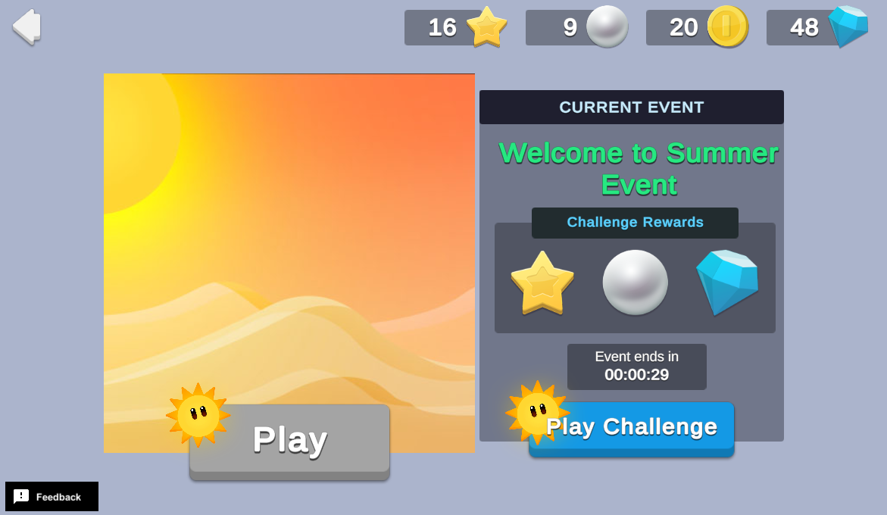

# Seasonal Events

Seasonal events can increase game sessions and overall interest in a game, because they give existing players new and fun content throughout the year to look forward to, and can entice new players to begin playing.

This sample shows how you can set up seasonal events. It showcases four events, Fall, Winter, Spring, and Summer, however you can extend this example to configure events for anything you want. Each event displays the currency rewards you can win during the event, a countdown indicating how much time is left in the current event, and a **Play Challenge** button that opens a popup where players can collect their rewards for "winning" the challenge.

## Overview

To see this use case in action:

1. In the Unity Editor **Project** window, select **Assets** > **Use Case Samples** > **Seasonal Events**, then double-click `SeasonalEventsSample.unity` to open the sample scene.
2. Enter Play Mode to interact with the use case.

### Initialization

The `SeasonalEventsSceneManager.cs` script performs the following initialization tasks in its `Start` function:

1. Initializes Unity Gaming Services.
2. Signs in the player [anonymously](https://docs.unity.com/authentication/UsingAnonSignIn.html) using the Authentication service. If you’ve previously initialized any of the other sample scenes, Authentication will use your cached Player ID instead of creating a new one.
3. Retrieves and updates the player's currency balances from the Economy service.
4. Calls the `GetServerTime` Cloud Code function in order to base Game Override and Remote Config data off the server time.
5. Queries the Remote Config service to get the current values for event-related keys (see section on event parameters below).

#### Event parameters

The Remote Config service stores key-value data for displaying the active event name, the potential rewards for completing the event challenge. These keys are also used to retrieve the event’s themed interface visuals from the Addressables service.

Remote Config also conveys when the event ends, which the `CountdownManager.cs` script references to determine how much time remains for the current event. When that time runs out, it triggers a new call to Remote Config to get the updated values for the next event.

**Note**: This sample determines which Game Override data to return based on the last digit of the number of minutes in the current server time. This is a simplification to be able to frequently observe the season change. In a real app, developers likely set up a Game Override to have specific start and end dates, then Remote Config determines when the Game Override is shown based on the server’s date and time. In that case, the client and server implementations can be a bit different.

### Functionality

#### Collect Rewards

The **Play** button on the left is *not interactable*, and is just added to demonstrate how a game might have gameplay in one area of the screen (on the left in this case) and permit playing the Seasonal Event either through gameplay or directly using a UI button such as the **Play Challenge** button on the bottom/right.

The **Play Challenge** button is an abstraction for gameplay that the player might engage in to earn event rewards. Clicking it opens a popup where players can collect rewards for "winning" the challenge. When you click the **Collect Rewards** button, the following occurs on the backend:

1. The button’s `OnClick` method calls the `SeasonalEvents_GrantEventReward.js` Cloud Code script, which queries the Remote Config service to determine which rewards to distribute.
 **Note**: Rewards could potentially differ from what the player expects, if they're altering their device clock or if they initiated their claim at the very end of an event.
2. Cloud Code then calls the Economy service to grant the appropriate rewards and update the player’s currency/inventory balance.
3. Once rewards are distributed, the calling script updates the currency HUD and closes the collect rewards popup.

You can only play the challenge once per active event, so after the Cloud Code script distributes rewards, it saves the current event name and timestamp to Cloud Save. The client uses this information to determine whether the current event has already been played, and if it has, to disable the **Play Challenge** button.

Additionally, Analytics custom events are sent each time the scene loads (`SceneOpened`), whenever a button is pressed (`ActionButtonPressed`), and when the back button in the scene is pressed.

## Setup

### Requirements

To replicate this use case, you need the following [Unity packages](https://docs.unity3d.com/Manual/Packages.html) in your project:

| **Package**                                                                     | **Role**                                                                                                                                                                                                                                                                 |
| ------------------------------------------------------------------------------- | ------------------------------------------------------------------------------------------------------------------------------------------------------------------------------------------------------------------------------------------------------------------------ |
| [Addressables](https://docs.unity3d.com/Packages/com.unity.addressables@latest) | Allows asset retrieval by address. Wherever the asset resides (local or remote), the system will locate it and its dependencies and then return it. In this sample, it retrieves event-specific images and prefabs based on information from Remote Config.              |
| [Analytics](https://docs.unity.com/Analytics)                                   | Sends events to track a player's in-game interactions, retention, and other information that you can use to analyze and improve the game experience.                                                                                                                     |
| [Authentication](https://docs.unity.com/Authentication)                         | Automatically signs in the user anonymously to keep track of their data on the server side.                                                                                                                                                                              |
| [Cloud Code](https://docs.unity.com//cloud-code/Content/implementation.htm)     | Contains important validation logic on the server side. In this sample, it distributes rewards for the event challenge. It also independently verifies the timestamp at the time of reward distribution on the server-side to confirm which event rewards to distribute. |
| [Cloud Save](https://docs.unity.com/cloud-save/implementation.htm)              | Stores a flag for whether the current challenge has already been played, to prevent the player from participating multiple times.                                                                                                                                        |
| [Economy](https://docs.unity.com/economy/Content/implementation.htm)            | Retrieves the player's starting and updated currency balances at runtime.                                                                                                                                                                                                |
| [Remote Config](https://docs.unity.com/remote-config)                           | Provides key-value pairs that can be changed server-side, either manually or based on specific Game Overrides. In this sample, the Game Overrides feature contains four seasonal events and returns different values for certain keys based on the active Game Override. |

To use these services in your game, activate each service for your Organization and project in the [Unity Dashboard](https://dashboard.unity3d.com/).

### Dashboard setup

To replicate this sample scene's setup on your own dashboard, you need to:

- Configure custom Analytics events and parameters.
- Publish a script in Cloud Code.
- Create four Currencies for the Economy service.
- Configure Remote Config values and Game Overrides.

#### Analytics

The Analytics custom events configuration contains a long list of potential parameters that are sent with some of the events. This extended list allows for a more flexible analysis of different parameter groupings in the **Data Explorer** on the [Analytics dashboard](https://dashboard.unity3d.com/analytics). Alternatively, you could send only the ungrouped parameters (for example, `buttonName` or `sceneName`), and perform any kind of grouped analysis by using the Data Export feature within the Data Explorer on the dashboard.

**Important**: This sample demonstrates the code that is needed to trigger Analytics events. However, additional code might be necessary to meet legal requirements such as GDPR, CCPA, and PIPL. For more information, see the documentation on [managing data privacy](https://docs.unity.com/analytics/ManagingDataPrivacy.html).

[Configure the following custom Analytics events](https://docs.unity.com/analytics/EventManager.html#Custom_Events):

| **Event name**      | **Description**                                                                                                                                                                  | **Custom parameters**                                                                                                                                  |
| ------------------- | -------------------------------------------------------------------------------------------------------------------------------------------------------------------------------- | ------------------------------------------------------------------------------------------------------------------------------------------------------ |
| `SceneOpened`         | Sent each time the scene loads.                                                                                                                                                  | <li>sceneName                                                                                                                                            |
| `ActionButtonPressed` | Sent for each button press in the scene.                                                                                                                                         | <li>buttonName</li><li>sceneName</li><li>remoteConfigActiveEvent</li><li>buttonNameBySceneName</li><li>buttonNameByRemoteConfigEvent</li><li>buttonNameBySceneNameAndRemoteConfigEvent |
| `SceneSessionLength`  | Sent to indicate the time spent in the scene (measured as the length of time between whenAnalyticsManager.Start() triggers and the player presses the back button in the scene). |</li><li>timeRange</li><li>sceneName</li><li>remoteConfigActiveEvent</li><li>timeRangeBySceneName</li><li>timeRangeByRemoteConfigEvent</li><li>timeRangeBySceneNameAndABGroup               |

Configure the following custom parameters to support your custom events:

| **Parameter name**                        | **Type** | **Description**                                                                                                                                                                                        |
| ----------------------------------------- | -------- | ------------------------------------------------------------------------------------------------------------------------------------------------------------------------------------------------------ |
| `buttonName`                                | STRING   | The name of the button that has been pressed.                                                                                                                                                          |
| `buttonNameByRemoteConfigEvent`             | STRING   | Formatted string grouping button name with Remote Config active event. Uses the format: "Button Name - Event Key".                                                                                     |
| `buttonNameBySceneName`                     | STRING   | Formatted string grouping button name with scene name. Uses the format: "Button Name - Scene Name".                                                                                                    |
| `buttonNameBySceneNameAndRemoteConfigEvent` | STRING   | Formatted string grouping button name with scene name and Remote Config active event. Uses the format: "Button Name - Scene Name - Event Key".                                                         |
| `remoteConfigActiveEvent`                   | STRING   | The active event as defined in and determined by Remote Config.                                                                                                                                        |
| `sceneName`                                 | STRING   | The name of the scene where the event was triggered.                                                                                                                                                   |
| `timeRange`                                 | STRING   | A range of time spent in the scene where the event was triggered.                                                                                                                                      |
| `timeRangeByRemoteConfigEvent`              | STRING   | Formatted string grouping time range with the active Remote Config Event at the time the event was sent. Uses the format: "Time Range - Event Key".                                                    |
| `timeRangeBySceneName`                      | STRING   | Formatted string grouping time range with the name of the scene where the time was spent. Uses the format: "Time Range - Scene Name".                                                                  |
| `timeRangeBySceneNameAndRemoteConfigEvent`  | STRING   | Formatted string grouping time range with the scene name and the Remote Config event that was active at the time the analytics event was sent. Uses the format: "Time Range - Scene Name - Event Key". |

#### Cloud Code

| **Script**         | **Parameters** | **Description**                                                                                       | **Location**                                                                          |
|--------------------| -------------- | ----------------------------------------------------------------------------------------------------- | ------------------------------------------------------------------------------------- |
| `GrantEventReward` | None           | Verifies and distributes event rewards.                                                               | `Assets/Use Case Samples/Seasonal Events/Cloud Code/SeasonalEvents_GrantEventReward.js` |
| `GetServerTime`    | None           | Retrieves the current timestamp from the server in order to base the UI on server-authoritative time. | `Assets/Use Case Samples/Seasonal Events/Cloud Code/SeasonalEvents_GetServerTime.js`    |

**Note**: The Cloud Code scripts included in theCloud Code folder are local copies because you cannot see the sample's dashboard. Changes to these scripts do not affect the behavior of this sample because they are not automatically uploaded to the Cloud Code service.

#### Economy

| **Resource type** | **Resource name** | **ID** | **Description**                                                |
| ----------------- | ----------------- | ------ | -------------------------------------------------------------- |
| Currency          | Coin              | `COIN`   | A challenge reward during the fall, winter, and spring events. |
| Currency          | Gem               | `GEM`    | A challenge reward during the winter and summer events.        |
| Currency          | Pearl             | `PEARL`  | A challenge reward during the fall and summer events.          |
| Currency          | Star              | `STAR`   | A challenge reward during the spring and summer events.        |

#### Remote Config

[Set up the following config values](https://docs.unity.com/remote-config/HowDoesRemoteConfigWork.html) in the **LiveOps** dashboard:

| **Value**          | **Type** | **Description**                                                                                                                     | **Value**                                                                                        |
|--------------------| -------- | ----------------------------------------------------------------------------------------------------------------------------------- |--------------------------------------------------------------------------------------------------|
| `EVENT_NAME`       | string   | The name of the event to display in the scene.                                                                                      | `""`                                                                                             |
| `EVENT_KEY`        | string   | The key that is used to look up event-specific values, such as the addresses for specific images.                                   | `""`                                                                                             |
| `EVENT_END_TIME`   | int      | The last digit that matches the Audience JEXL statement, or the last digit of the latest timestamp that would return this Campaign. | `0`                                                                                              |
| `CHALLENGE_REWARD` | JSON     | The JSON that specifies what rewards to distribute when a challenge is "won".                                                       | `{ "rewards": \[{ "id": "COIN", "quantity": 100, "sprite_address": "Sprites/Currency/Coin" }] }` |

#### Game Overrides

[Configure the following Overrides](https://docs.unity.com/gameoverrides/CreateAnOverride.html) in the **LiveOps** dashboard:

| **Details**    | Name the Override “Fall Event”.                                                                                                                                                                                                                                                                                                                                                                                                                                                                                                                                                                                                                                                                                                                           |
|----------------|-----------------------------------------------------------------------------------------------------------------------------------------------------------------------------------------------------------------------------------------------------------------------------------------------------------------------------------------------------------------------------------------------------------------------------------------------------------------------------------------------------------------------------------------------------------------------------------------------------------------------------------------------------------------------------------------------------------------------------------------------------------|
| **Targeting**  | Select **Stateless JEXL** with the following JEXL code: user.timestampMinutes % 10 == 0 &vert;&vert; user.timestampMinutes % 10 == 1 &vert;&vert; user.timestampMinutes % 10 == 2                                                                                                                                                                                                                                                                                                                                                                                                                       |
| **Content**    | Select **Choose content type** > **Config Overrides**, then enter override values for the following keys: <ul><li>`EVENT_NAME`: `“Fall Event”`</li><li>`EVENT_KEY`: `“Fall”`</li><li>`EVENT_END_TIME`: `2`</li><li>`EVENT_TOTAL_DURATION_MINUTES`: `3`</li><li>`CHALLENGE_REWARD`:</li><ul>{ "rewards":<ul>\[{<ul>"id": "COIN", "quantity": 100, "spriteAddress": "Sprites/Inventory/Coin" </ul>}, {<ul>"id": "PEARL", "quantity": 50, "spriteAddress": "Sprites/Inventory/Pearl" </ul>}]</ul>} |
| **Scheduling** | Set the following start and end dates:<ul><li>Set **Start Date** to **Update content immediately**.</li><li>Set **End Date** to **Run indefinitely**.</li></ul>                                                                                                                                                                                                                                                                                                                                                                                                                                                                                                                                                                                           |

| **Details**    | Name the Override “Winter Event”.                                                                                                                                                                                                                                                                                                                                                                                                 |
|----------------|-----------------------------------------------------------------------------------------------------------------------------------------------------------------------------------------------------------------------------------------------------------------------------------------------------------------------------------------------------------------------------------------------------------------------------------|
| **Targeting**  | Select **Stateless JEXL** with the following JEXL code: user.timestampMinutes % 10 == 3 &vert;&vert; user.timestampMinutes % 10 == 4                                                                                                                                                                                                                                                                                           |
| **Content**    | Select **Choose content type** > **Config Overrides**, then enter override values for the following keys: <ul><li>`EVENT_NAME`: `“Winter Event”`</li><li>`EVENT_KEY`: `“Winter”`</li><li>`EVENT_END_TIME`: `4`</li><li>`EVENT_TOTAL_DURATION_MINUTES`: `2`</li><li>`CHALLENGE_REWARD`:</li><ul>{ "rewards":<ul>\[{<ul>"id": "COIN", "quantity": 100, "spriteAddress": "Sprites/Inventory/Coin" </ul>}, {<ul>"id": "GEM", "quantity": 50, "spriteAddress": "Sprites/Inventory/Gem" </ul>}]</ul>} |
| **Scheduling** | Set the following start and end dates:<ul><li>Set **Start Date** to **Update content immediately**.</li><li>Set **End Date** to **Run indefinitely**.</li></ul>                                                                                                                                                                                                                                                                                                                                                                                                                                                                                                                                                                                           |

| **Details**    | Name the Override “Spring Event”.                                                                                                                                                                                                                                                                                                                                                    |
| -------------- | ------------------------------------------------------------------------------------------------------------------------------------------------------------------------------------------------------------------------------------------------------------------------------------------------------------------------------------------------------------------------------------ |
| **Targeting**  | Select **Stateless JEXL** with the following JEXL code: user.timestampMinutes % 10 == 5 &vert;&vert; user.timestampMinutes % 10 == 6 &vert;&vert; user.timestampMinutes % 10 == 7                                                                                                                                                                                                                                                                                           |
| **Content**    | Select **Choose content type** > **Config Overrides**, then enter override values for the following keys: <ul><li>`EVENT_NAME`: `“Spring Event”`</li><li>`EVENT_KEY`: `“Spring"`</li><li>`EVENT_END_TIME`: `7`</li><li>`EVENT_TOTAL_DURATION_MINUTES`: `3`</li><li>`CHALLENGE_REWARD`:</li><ul>{ "rewards":<ul>\[{<ul>"id": "COIN", "quantity": 100, "spriteAddress": "Sprites/Inventory/Coin" </ul>}, {<ul>"id": "STAR", "quantity": 50, "spriteAddress": "Sprites/Inventory/Star" </ul>}]</ul>} |
| **Scheduling** | Set the following start and end dates:<ul><li>Set **Start Date** to **Update content immediately**.</li><li>Set **End Date** to **Run indefinitely**.</li></ul>                                                                                                                                                                                                                                                                                                                                                                                                                                                                                                                                                                                           |

| **Details**    | Name the Override “Summer Event”.                                                                                                                                                                                                                                                                                                                                                    |
| -------------- | ------------------------------------------------------------------------------------------------------------------------------------------------------------------------------------------------------------------------------------------------------------------------------------------------------------------------------------------------------------------------------------ |
| **Targeting**  | Select **Stateless JEXL** with the following JEXL code: user.timestampMinutes % 10 == 8 &vert;&vert; user.timestampMinutes % 10 == 9                                                                                                                                                                                                                                                                                           |
| **Content**    | Select **Choose content type** > **Config Overrides**, then enter override values for the following keys: <ul><li>`EVENT_NAME`: `“Summer Event”`</li><li>`EVENT_KEY`: `“Summer”`</li><li>`EVENT_END_TIME`: `9`</li><li>`EVENT_TOTAL_DURATION_MINUTES`: `2`</li><li>`CHALLENGE_REWARD`:</li><ul>{ "rewards":<ul>\[{<ul>"id": "STAR", "quantity": 50, "spriteAddress": "Sprites/Inventory/Star" </ul>}, {<ul>"id": "PEARL", "quantity": 50, "spriteAddress": "Sprites/Inventory/Pearl" </ul>}, {<ul>"id": "GEM", "quantity": 50, "spriteAddress": "Sprites/Inventory/Gem" </ul>}]</ul>} |
| **Scheduling** | Set the following start and end dates:<ul><li>Set **Start Date** to **Update content immediately**.</li><li>Set **End Date** to **Run indefinitely**.</li></ul>                                                                                                                                                                                                                                                                                                                                                                                                                                                                                                                                                                                           |

**Important**: After configuring your Overrides, remember to enable them by selecting the Override from the list and clicking the **Enable** button.  
