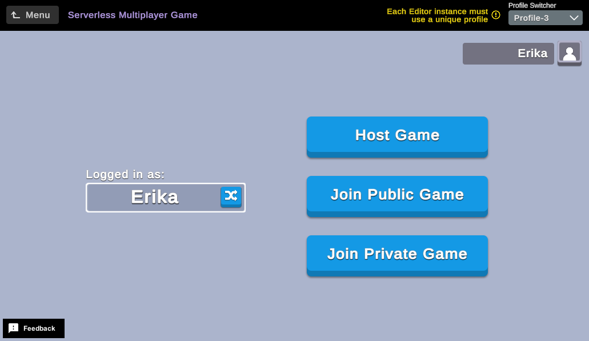

# Serverless Multiplayer Game

Multiplayer games are a popular game mechanic that allow multiple players to interact and play games together.

This sample demonstrates how to create or join a Lobby Service game lobby and compete in a simple arena-style game where players collect coins for points.

**Important:** Unless you are testing the serverless multiplayer game sample on different devices you must set each instance to a different profile using the profile switcher drop-down at the top of the screen. See [Set up computer to test multiplayer](#set-up-computer-to-test-multiplayer) for explanation and additional details.



## Overview

To see this use case in action:
1. In the Unity Editor **Project** window, select **Assets** > **Use Case Samples** > **Serverless Multiplayer Game**.
2. Double-click `ServerlessMultiplayerGameSample.unity` to open the main sample scene.
3. Enter Play Mode to interact with the use case.

As you interact with the sample, the use case progresses through the following three scenes:
1. The `ServerlessMultiplayerGameSample` scene, the initial scene where players can choose to start or join a lobby.
2. The `Lobby` scene, which shows the current lobby and its players and where players can indicate readiness to start the game.
3. The `Game` scene, where players move about in real time and collect coins.

During the course of the sample, players can perform the following actions:
- Randomize their names.
- Create public and private lobbies for others to join.
- Join lobbies either from a list of public lobbies or by entering a secret key to join private ones.
- View other players in the lobby.
- Signal they are ready to start the game.
- Play a multiplayer game using Relay Service and Netcode for GameObjects (NGO) to facilitate player movement and collect coins for points.
- View information such as winners, scores, and personal high stats at the end of the game.

### Initialization

When the scene loads, the following initialization steps occur:

1. Sample-related managers are set to DontDestroyOnLoad so they can remain intact in all scenes of the sample.
2. The Profanity Manager is initialized, causing all valid player names and lobby words to be propagated to the allow list so only permitted words will be presented to the player.
3. UGS is initialized and the player signed in with the correct profile name.
4. Remote Config is read to configure coin spawning, game duration, etc.
5. The main menu is shown so the player can choose to host or join a game, randomize his/her name, change UGS profile name to use, etc.

### Functionality

#### Set up computer to test multiplayer

You must be able to play multiple instances of this sample to test this use case.

The following are some techniques to facilitate multiplayer testing:
- Clone the repository again (or copy the project folder) to another folder. You can then open both/all instances in the Unity Editor simultaneously and enter Play Mode in each instance to test the sample.
- Use [ParrelSync](https://github.com/VeriorPies/ParrelSync) to clone the project. This is the preferred method because changes made to the base project automatically propagate to all clones for testing. Note that this is not a Unity product so we recommend reviewing the documentation and license agreement before using. 
- Install the sample on multiple physical devices.

**Important:** If you choose to use either of the first two options listed above, ensure that each instance is signed in to UGS with a different anonymous ID.
Do this by changing the `Profile ID` on the main scene to a different profile (the scene defaults to the last profile used or `Profile-1` by default).
Changing this profile selection signs you in to a different Authentication service profile which simulates having multiple accounts on a single device.
Note that the profile switcher only works on the main scene; once you leave to create or join a lobby, the choice is locked in and you cannot change it until you return to the main scene.
For more details, refer to [Manage profiles](https://docs.unity.com/authentication/en/manual/ProfileManagement).

#### Scenes

This use case contains multiple scenes to divide the sample into smaller pieces, allowing developers to only review the implementation they're interested in learning.

**Note:**
Always begin Play Mode with the `ServerlessMultiplayerGameSample` scene, which changes to the other scenes as needed.

##### ServerlessMultiplayerGameSample scene

The sample begins with the `ServerlessMultiplayerGameSample` scene where players can choose to start or join a lobby, randomize their player name, and, if creating a lobby, randomize the lobby name, and adjust setup parameters such as max players or public/private flag.

The player remains in this scene until a lobby is either created or joined, both of which causing play to progress to the `Lobby` scene.

Once a game ends or the player leaves the `Lobby` scene, they return to this scene.
If the player just finished playing a game, the results screen displays the outcome along with the current player's stats.
Closing the results screen returns the player to the main menu so another lobby can be created/joined to start a new game.

##### Lobby scene

Once a lobby has been created or joined on the `ServerlessMultiplayerGameSample` scene, the sample opens the `Lobby` scene, which shows the contents of the current lobby, and permits players to signal ready or leave.
Additionally, the host has the option to remove players from the lobby.
All players are required to signal they are ready before a game can begin.

Players remain in this scene until all players are ready (play proceeds to `Game` scene), or the player leaves the lobby and returns to the `ServerlessMultiplayerGameSample` scene.

##### Game scene

After a minimum of two players have joined the lobby and all players have signaled ready, the `Game` scene launches, where an immediate countdown from three begins.
Once complete, players can move and collect coins, which are spawned individually or in clusters (based on the [Remote Config configuration](#remote-config)).
Once players can move, the game timer begins counting down and the game ends once the game timer expires.

When the game ends due to the game timer expiring, players automatically return to the `ServerlessMultiplayerGameSample` scene, where the game results as well as each player's personal stats appear.
Once that results screen closes, the main menu reappears (still in the `ServerlessMultiplayerGameSample`) and another lobby can be created or joined.

#### Notable manager classes

This use case has a few notable manager classes that facilitate different aspects of the sample.
The `ProfanityManager` class ensures that user generated strings don't contain offensive language, while the `GameManager` class processes requests from players, controls gameplay, and updates clients’ state based on game events.

##### Profanity Manager

This sample implements a Profanity Manager to ensure that the player and lobby names created by one player, but visible to all players, do not include any offensive language.
The `ProfanityManager` class uses an allowlist to validate the strings that the client receives from the Lobby Service.
This validation ensures that even if one player hacks the system to submit an offensive string, any other players who receive that lobby name or username would not be able to see the invalid string.

Note that using an allowlist for input such as usernames can be limiting, since it is difficult to make such a list exhaustive.
In this case, you could instead use a blocklist to filter out the specific words deemed inappropriate.

You can find the `ProfanityManager` class in` Serverless Multiplayer Game/Scripts/Menu/ProfanityManager.cs`, and the strings included in the player and lobby names allowlists are in `Serverless Multiplayer Game/Scripts/Menu/PlayerNameManager.cs` and `Serverless Multiplayer Game/Scripts/Menu/LobbyNameManager.cs`, respectively.
If you wanted to use a refactored version of the Profanity Manager, replace the `ProfanityManager.IsValidPlayerName` and `ProfanityManager.IsValidLobbyName` methods with your own implementation.

##### Game Network Manager

Being a multiplayer game, this sample requires a Game Network Manager to facilitate game communication between players.
The Game Network Manager is instantiated on the host when the `Game` scene is first loaded due to the existence of a `GameSceneManager` in the scene.
This Game Network Manager instantiates the Game Network Manager in its `Start()` method.

The Game Network Manager handles things such as
- Starting the host/client
- Creating player avatars for all players
- Coordinating countdowns and game timers
- Allowing players to move to collect coins once countdown is complete
- Communicating with other managers when needed, such as when scoring
- Coordinating game over by propagating the final score and waiting for all players to acknowledge receipt
- Issuing request that all players return to main menu

As mentioned above, the Game Network Manager is instantiated at runtime so it can be properly configured on the host using `NetworkObject.SpawnWithOwnership`.
Thus, the host has control of the Game Network Manager, and all clients are able to interact with it as needed to facilitate gameplay.

The `GameNetworkManager` class can be found at `Serverless Multiplayer Game/Scripts/Game/GameNetworkManager.cs`.

## Setup

### Requirements

To replicate this use case, you need the following [Unity packages](https://docs.unity3d.com/Manual/Packages.html) in your project:

| **Package**                                                                                          | **Role**                                                                                                                                                                                                                                          |
|------------------------------------------------------------------------------------------------------|---------------------------------------------------------------------------------------------------------------------------------------------------------------------------------------------------------------------------------------------------|
| [Authentication](https://docs.unity.com/authentication/IntroUnityAuthentication.html)                | Automatically sign in the user anonymously to keep track of their data on the server side. This sample also uses the Authentication service to switch profiles to simulate different players to facilitate multiplayer testing.                   |
| [Cloud Save](https://docs.unity.com/cloud-save/index.html#Implementation)                            | Stores the player's name, win/games counts and high scores.                                                                                                                                                                                       |
| [Lobby](https://docs.unity.com/lobby/en/manual/lobby-sdk-installation)                               | Handles creating or joining lobbies so players can gather to start a game. The lobby also stores each player's ready flag, as well as the Relay Join Code, which is needed to join the Relay Service allocation to facilitate real-time gameplay. |
| [Netcode for GameObjects](https://docs-multiplayer.unity3d.com/netcode/current/installation/install) | Spawn network objects such as player avatars and coins, synchronize movement and despawn network objects as needed.                                                                                                                               |
| [Relay](https://docs.unity.com/relay/en/manual/get-started)                                          | Creates/joins a multiplayer allocation to facilitate real-time gameplay with the creator of the lobby acting as relay service host.                                                                                                               |
| [Remote Config](https://docs.unity3d.com/Packages/com.unity.remote-config@latest)                    | Maintain game settings such as coin spawning frequency, coin wave sizes, game duration, etc.                                                                                                                                                      |

### Cloud Save

This sample uses Cloud Save to store each player's lifetime stats, which include name, win count, total game count and high scores.
Note that using different profiles results in each having separate UGS data, so each player sees different stats.

The following is an example of a player's Cloud Save data:

```json
{
    "playerName": "Erika",
    "highScores": [33, 27, 17],
    "winCount": 14,
    "gameCount": 15
}
```

### Dashboard setup

To replicate this sample scene's setup on your own dashboard, you need to:
* Configure values for the Remote Config service.

#### Remote Config

[Set up the following config value](https://docs.unity.com/remote-config/HowDoesRemoteConfigWork.html) in the **LiveOps** dashboard:

| **Key**                      | **Type** | **Description**                                                                           | **Value**                                                                                                                                                                                                                                                                                                                                                                                                                                                                                                                                                                                                                                                                                           |
|------------------------------|----------|-------------------------------------------------------------------------------------------|-----------------------------------------------------------------------------------------------------------------------------------------------------------------------------------------------------------------------------------------------------------------------------------------------------------------------------------------------------------------------------------------------------------------------------------------------------------------------------------------------------------------------------------------------------------------------------------------------------------------------------------------------------------------------------------------------------|
| `MULTIPLAYER_GAME_SETTINGS`  | JSON     | List of game settings for all possible games, based on the number of players in the game. | {<ul> `"playerOptions"`: [<ul>{<ul> `"players"`: 2,</br>`"gameDuration"`: 60,</br>`"initialSpawnDelay"`: 1,</br>`"spawnInterval"`: 6,</br>`"destroyInterval"`: 7,</br>`"cluster1"`: 1,</br>`"cluster2"`: 1,</br>`"cluster3"`: 0</br></ul>} , </br>{<ul> `"players"`: 3,</br>`"gameDuration"`: 60,</br>`"initialSpawnDelay"`: 2,</br>`"spawnInterval"`: 5,</br>`"destroyInterval"`: 5.5,</br>`"cluster1"`: 1,</br>`"cluster2"`: 1,</br>`"cluster3"`: 1</br></ul>} , </br>{<ul> `"players"`: 4,</br>`"gameDuration"`: 60,</br>`"initialSpawnDelay"`: 3,</br>`"spawnInterval"`: 4,</br>`"destroyInterval"`: 4.5,</br>`"cluster1"`: 1,</br>`"cluster2"`: 2,</br>`"cluster3"`: 1</br></ul>} </ul>]</ul>} |


Additional information about the fields in the above config value:

| **Field**           | **Description**                                                                                                                                                                                                                                     |
|---------------------|-----------------------------------------------------------------------------------------------------------------------------------------------------------------------------------------------------------------------------------------------------|
| `players`           | Number of players in specified configuration. Valid values are 2, 3 and 4 and there must be 1 of each to specify game configuration for each count of players.                                                                                      |
| `gameDuration`      | Length of game in seconds. All games currently last 60 seconds, but these values could be changed for longer games with more players.                                                                                                               |
| `initialSpawnDelay` | How long to wait to spawn first set of coins. This permits players to get their bearings before the initial wave of coins appears.                                                                                                                  |
| `destroyInterval`   | How long do coins remain in play before despawning. This adds urgency because coins can disappear, requiring players to hurry to capture them in time.                                                                                              |
| `spawnInterval`     | How long to wait after a wave of coins is spawned before spawning the next wave. Coins spawn in waves so players have multiple options of coins to attempt to collect.                                                                              |
| `cluster1`          | How many clusters of one coin (that is, individual coins) should be spawned in each wave. There is usually one cluster of one, so a player with no better option can at least try for the single coin.                                              |
| `cluster2`          | How many clusters of two coins (that is, pairs of coins) should be spawned in each wave. There is usually at least one cluster of two coins so one of the players can have an opportunity to score two points while the other player only gets one. |
| `cluster3`          | How many clusters of three coins to spawn per wave. Two-player games don't need clusters of three, but games with more players can add three coin clusters.                                                                                         |
