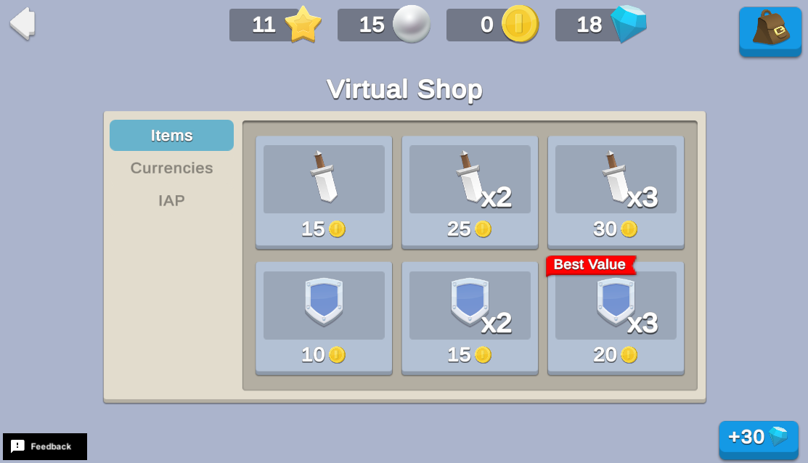

# Virtual Shop
The Virtual Shop is a key feature in most free-to-play games. They allow players to purchase items and exchange resources within the game environment to facilitate the in-game economy. When properly implemented as part of your core game loop, they can drive engagement and provide opportunities for players to express their unique playstyles.



## Overview

To see this use case in action:

1. In the Unity Editor Project window, select **Assets** > **Use Case Samples** > **Virtual Shop**, and then double-click `VirtualShopSample.unity` to open the sample scene.
2. Enter Play mode to interact with the use case.

At startup, this scene reads the Remote Config for the Virtual Shop use case sample as well as all required Virtual Purchases. It sets up sprites for all Currency and Inventory Items for use in the Virtual Shop display, initializes the Currency HUD with correct values and presents the first Category's Virtual Purchases to the player for purchase.

### Initialization

When the scene loads, the `VirtualShopSceneManager.cs` script performs the following initialization tasks:

1. Initializes Unity Gaming Services.
2. Signs in the player [anonymously](https://docs.unity.com/authentication/UsingAnonSignIn.html) using the Authentication service. If you’ve previously initialized any of the other sample scenes, Authentication will use your cached Player ID instead of creating a new one.
3. Retrieves and updates the player's currency balances from the Economy service.
4. Queries the Remote Config service to fetch the Virtual Shop configuration data. This includes:
    1. Currency and inventory item sprites from the Addressables service so they can be displayed in the shop UI.
    2. Virtual Purchase Transactions for use in the store. The Remote Config data determines which categories to put each transaction in, and which icons to use.
5. The client updates the shop UI based on the Remote Config data.

### Functionality

#### Inventory button

The inventory button in the top-right corner opens a pop-up showing all currently-owned inventory items. Use it to confirm that purchased items were added to your inventory appropriately. Note that inventory items appear in random order, so new purchases may appear in the middle of the list.

#### Gain currency debug button

The **+30** Gems button in the bottom-right corner adds currency for testing purposes.

#### Virtual Purchases

The shop interface shows the items for sale, along with their respective costs. Click any item to attempt a Virtual Purchase through the Economy service. A pop-up appears to confirm if the purchase succeeded or failed. 

**Note:** Most games will disable buttons for purchases the user cannot afford. However, this sample allows you to attempt all purchases regardless, to facilitate testing how the Economy service verifies Virtual Purchases.

#### Category buttons

You can change purchase categories by clicking the tabs to the left of the purchase grid. Choose between **Currencies**, **Items**, and **IAP** to display the corresponding list of purchases as specified by the Remote Config JSON. 

**Note:** The **IAP** category is currently unavailable for this sample.

#### Back button

Pressing the back button in the top-left corner returns you to the "Start Here" scene.

## Setup

### Requirements

To replicate this use case, you need the following [Unity packages](https://docs.unity3d.com/Manual/Packages.html) in your project:

| **Package**                                                                           | **Role**                                                                                                                                                                                                                                                                               |
|---------------------------------------------------------------------------------------|----------------------------------------------------------------------------------------------------------------------------------------------------------------------------------------------------------------------------------------------------------------------------------------|
| [Addressables](https://docs.unity3d.com/Packages/com.unity.addressables@latest)       | Allows developers to ask for an asset via its address. Wherever the asset resides (local or remote), the system will locate it and its dependencies, then return it.                                                                                                                   |
| [Authentication](https://docs.unity.com/authentication/IntroUnityAuthentication.html) | Automatically signs in the user anonymously to keep track of their data on the server side.                                                                                                                                                                                            |
| [Economy](https://docs.unity.com/economy/implementation.html)                         | Keeps track of the player's currencies and inventory items, as well as definitions for all currencies, inventory items and Virtual Purchase transactions. Currencies and inventory items all include Custom data to identify which icon sprites to use in the shop.                    |
| [Remote Config](https://docs.unity3d.com/Packages/com.unity.remote-config@latest)     | Provides key-value pairs where the value that is mapped to a given key can be changed on the server-side, either manually or based on specific Game Overrides. The `VIRTUAL_SHOPS_CONFIG` entry stores all details for Virtual Purchase transactions to be available in each Category. |

To use these services in your game, activate each service for your Organization and project in the [Unity Dashboard](https://dashboard.unity3d.com/).

### Dashboard setup

To replicate this sample scene's setup on your own dashboard, you need to:

* Create Currencies, Inventory Items, and Virtual Purchases for the Economy service.
* Configure values in the Remote Config service.


#### Economy

[Configure the following resource](https://docs.unity.com/economy/) in the **LiveOps** dashboard:

| **Resource type**  | **Resource item**  | **ID**   | **Custom data**                                 | **Description**                                            |
|:-------------------|:-------------------|:---------|:------------------------------------------------|:-----------------------------------------------------------|
| Currency           | Coin               | `COIN`   | `{"spriteAddress": "Sprites/Currency/Coin"}`    | A currency you can spend and purchase in the virtual shop. |
| Currency           | Gem                | `GEM`    | `{"spriteAddress": "Sprites/Currency/Gem"}`     | A currency you can spend in the virtual shop.              |
| Currency           | Pearl              | `PEARL`  | `{"spriteAddress": "Sprites/Currency/Pearl"}`   | A currency you can purchase in the virtual shop.           |
| Currency           | Star               | `STAR`   | `{"spriteAddress": "Sprites/Currency/Star"}`    | A currency you can purchase in the virtual shop.           |
| Inventory Item     | Sword              | `SWORD`  | `{"spriteAddress": "Sprites/Inventory/Sword"}`  | An item you can purchase in the virtual shop.              |
| Inventory Item     | Shield             | `SHIELD` | `{"spriteAddress": "Sprites/Inventory/Shield"}` | An item you can purchase in the virtual shop.              |

\* This sample uses Addressable Assets to implement the sprite icons for all Economy resources. As the developer, you can add the Addressables address of the icon for each currency directly in the Economy dashboard, and then retrieve it at runtime without needing to change your code. This is helpful if for example, you want to update currency icons by changing the address in your dashboard instead of updating your app. To do this for each resource:

1. Select the currency you want to edit.
2. Under **Custom data**, click the plus (**+**) icon to add a custom JSON script.
3. Add the `spriteAddress` value, along with the corresponding Addressable address string listed in the table.

When the client needs to initialize sprites (for example, to display the costs and rewards for each virtual purchase for sale in the shop), the resource’s ID acts as a dictionary key to quickly find the associated spirit. The client calls the `AddressablesManager.cs` script’s `PreloadAllEconomySprites()` method at startup to initialize the dictionary with all icon sprites, and the `preloadedSpritesByEconomyId` dictionary is used to look up Economy IDs to find the associated sprite to use in the shop display.

In addition, [configure the following virtual purchases](https://docs.unity.com/economy/item-types.html#Virtual_purchase) for the virtual shop:

| **Item name**      | **ID**                            | **This purchase buys**  | **This purchase costs** |
| :----------------- | :-------------------------------- | :---------------------- | :---------------------- |
| 1 Sword for Coins  | `VIRTUAL_SHOP_1_SWORD_FOR_COINS`  | Sword (1)               | Coins (15)              |
| 2 Sword for Coins  | `VIRTUAL_SHOP_2_SWORD_FOR_COINS`  | Sword (2)               | Coins (25)              |
| 3 Sword for Coins  | `VIRTUAL_SHOP_3_SWORD_FOR_COINS`  | Sword (3)               | Coins (30)              |
| 1 Shield for Coins | `VIRTUAL_SHOP_1_SHIELD_FOR_COINS` | Shield (1)              | Coins (10)              |
| 2 Shield for Coins | `VIRTUAL_SHOP_2_SHIELD_FOR_COINS` | Shield (2)              | Coins (15)              |
| 3 Shield for Coins | `VIRTUAL_SHOP_3_SHIELD_FOR_COINS` | Shield (3)              | Coins (20)              |
| 100 Coin for Gems  | `VIRTUAL_SHOP_100_COIN_FOR_GEMS`  | Coin (100)              | Gem (7)                 |
| 250 Coin for Gems  | `VIRTUAL_SHOP_250_COIN_FOR_GEMS`  | Coin (250)              | Gem (15)                |
| 1000 Coin for Gems | `VIRTUAL_SHOP_1000_COIN_FOR_GEMS` | Coin (1000)             | Gem (25)                |
| 1 Star for Coins   | `VIRTUAL_SHOP_1_STAR_FOR_COINS`   | Star (1)                | Coin (25)               |
| 3 Pearl for Coins  | `VIRTUAL_SHOP_3_PEARL_FOR_COINS`  | Pearl (3)               | Coin (50)               |

#### Remote Config
[Set up the following config values](https://docs.unity.com/remote-config/HowDoesRemoteConfigWork.html) in the **LiveOps** dashboard:

| **Key**               | **Type** | **Description**                                                                                |
| :-------------------- | :------- | :--------------------------------------------------------------------------------------------- |
| `VIRTUAL_SHOP_CONFIG` | JSON     | Contains information about Virtual Purchases and where they should appear in the virtual shop. |

Enter the following JSON data for the `VIRTUAL_SHOP_CONFIG` key:

```json
{
    "categories": [{
        "id": "Items",
        "enabledFlag": true,
        "items": [{
            "id": "VIRTUAL_SHOP_1_SWORD_FOR_COINS"
        }, {
            "id": "VIRTUAL_SHOP_2_SWORD_FOR_COINS",
            "color": "#FFFFFFFF",
            "badgeIconAddress": ""
        }, {
            "id": "VIRTUAL_SHOP_3_SWORD_FOR_COINS",
            "color": "#FFFFFFFF",
            "badgeIconAddress": ""
        }, {
            "id": "VIRTUAL_SHOP_1_SHIELD_FOR_COINS",
            "color": "#FFFFFFFF",
            "badgeIconAddress": ""
        }, {
            "id": "VIRTUAL_SHOP_2_SHIELD_FOR_COINS",
            "color": "#FFFFFFFF",
            "badgeIconAddress": ""
        }, {
            "id": "VIRTUAL_SHOP_3_SHIELD_FOR_COINS",
            "color": "#FFFFFFFF",
            "badgeIconAddress": "Sprites/Badges/Banner",
            "badgeColor": "#FF0000FF",
            "badgeText": "Best Value",
            "badgeTextColor": "#FFFFFFFF"
        }]
    }, {
        "id": "Currencies",
        "enabledFlag": true,
        "items": [{
            "id": "VIRTUAL_SHOP_100_COIN_FOR_GEMS",
            "color": "#FFFFFFFF",
            "badgeIconAddress": ""
        }, {
            "id": "VIRTUAL_SHOP_250_COIN_FOR_GEMS",
            "color": "#FFFFFFFF",
            "badgeIconAddress": ""
        }, {
            "id": "VIRTUAL_SHOP_1000_COIN_FOR_GEMS",
            "color": "#FFFFFFFF",
            "badgeIconAddress": "Sprites/Badges/Banner",
            "badgeColor": "#FF0000FF",
            "badgeText": "Best Value",
            "badgeTextColor": "#FFFFFFFF"
        }, {
            "id": "VIRTUAL_SHOP_1_STAR_FOR_COINS",
            "color": "#FFFFFFFF",
            "badgeIconAddress": ""
        }, {
            "id": "VIRTUAL_SHOP_3_PEARL_FOR_COINS",
            "color": "#FFFFFFFF",
            "badgeIconAddress": ""
        }]
    }, {
        "id": "IAP",
        "enabledFlag": false,
        "items": []
    }]
}
```
